## 引言

1. 系统结构 主要研究：`降低功耗`、`降低成本`、`增加性能`
2. 处于软硬件之间，进行连接作用
3. 比较接近本质，学会了本质，在应用层就好混多了


## 第一章：概述

**本章要点：**

1. 层次性、系统结构等概述
2. 软硬件取舍
3. 定量分析原理
4. 并行性概念


**实际内容：**

- **计算机系统的层次结构**

  - 计算机系统是由硬件 + 固件 +  软件
    - 固件：软件到固化硬件上，较难更改的，如:BIOS
  - 透明性：高层可以不必关注底层，底层对高层是透明的、看不见的
    - 如果要专业还是要关注底层
  - 层次
    - **浅蓝色的是硬件层，无色的是软件层**
    - 应用语言：如国语，你对人工智能说一句国语指令，他会给你相对应的操作
    - 高级语言：如：Java、C ，把应用语言变成实际的动作
    - 汇编语言：如：早期的语言，C语言是先转换成汇编在转换成机器语言
    - 计算机虚拟机：如：Windows，实现硬件交互提供一些硬件API给汇编、高级语言使用
    - <font color='cornflowerblue'>机器语言：纯粹的0和1，如：你是32位操作系统，那一个指令序列就是32个0和1</font>
    - <font color='cornflowerblue'>微程序语言：如：32位操作系统，一个指令序列又被分为3到5个微程序语言给硬件操作</font>
  - 语言的特性
    - 翻译/编译性：如：C语言，直接写完，直接全部翻译成机器语言
    - 解释性：如：Python，执行一条，让Python解释器解释一条，语句是一条一条执行的。所以IDE才可以注入代码

- 计算机系统结构

  - 系统结构是为判断一个功能，用软件实现比较好，还是硬件
  - 相同的系统结构，可以有不同的组成，一种组成又有不同的实现
  - 系统结构：如：我需要一台绘图的电脑，绘图的软件、选择几核的CPU、什么显卡
  - 计算机组成：如：我要2核的CPU，又有各种型号的CPU
  - 计算机实现：实际制作的技术，如：我使用32纳米能做，使用28纳米也能做，只是性能等不一样

- 计算机系统的软硬件取舍

  - 设计系统结构的时候应该把价格比考虑进去，以合适的价格设计出功能

  - 硬件的性能往往要比软件高

  - 设计系统的时候要考虑，硬件，软件

    - 如：服务器的CPU和家用的CPU
    - 如：画图工具和PS

  - 成本计算公式

    - 成本计算中要计算性能、综合指标

    - Dh是硬件研制成本， Ds是软件的研发成本

    - Mh是硬件生产成本，Ms软件生产成本

      - 软件的生产成本是维护、实施等

    - C是软件需再次设计的次数，R是软件重新生产的次数

    - 假定生产V台：

      - 硬件的成本：
        $$
        Dh / V + Mh
        $$

- 软件的成本：
      $$
      C * Ds / V + R * Ms
      $$
      

  - 只有当硬件成本小于软件成本时，用硬件才适合

- 计算机系统的性能，定量分析

  - <font color='red'>系统思维：看全局，不要单看一处</font>

  - 性能指标

    - **蓝色字体可以参考，但不一定准确**

    - 响应时间：如：你请求一个网页，从发出请求，到浏览器渲染完成的时间,你自然希望越快越好

    - 吞吐量：如：100万人访问一个网页，我只要这个网页能在1.5秒内响应完成就行了。

    - <font color='cornflowerblue'>处理机主频：主频、外频、倍频</font>

    - <font color='cornflowerblue'>MIPS：每秒百万条指令。</font>

      - $$
        MIPS = 指令条数 / 执行时间 * 10的六次方
        $$

        

    - <font color='cornflowerblue'>Mflops：每秒百万浮点指令</font>

    - 真实程序的运行时间

      - 有特定的机构会发布特定的测试程序，让两个机器来运行该程序，得出的时间短的就好

  - 大概率事件优先原则（哈夫曼压缩原理）

    - 加快经常性事件的速度

  - 阿姆达尔（Amdehl）定律

    - 定义系统性能的加速比，确定性能，计算改进某些部件所获得的性能提升
- 如：我扫描功能比较慢，那我改进扫描的硬件，提高性能
  
    - 加速比公式：

$$
改进前总执行时间 = 不可改进部分的执行时间 + 可改进部分改进后的执行时间
$$

$$
改进后总执行时间 = (1 - 可改进比例) * 总执行时间改进前 + 可改进比例 *改进前总执行时间 / 
部件加速比 = [(1-可改进比例) + 可改进比例/部件加速比] * 改进前总执行时间
$$

$$
加速比 = 改进后系统性能 / 改进前系统性能=改进前总执行时间/改进后总执行时间 = 1/ (1-可改进比例) + 可改进比例/部件加速比
$$


- 例子：

- 将计算机系统中某一功能的处理速度提高到原来的**20倍**，该功能的处理时间仅占整个系统运行时间的**40%**，则采用提高性能的方法后，能使整个系统的性能提高多少？

  - 解：
    - 可改进比例是40% = 0.4
    - 部件加速比是 20
    - 总加速比 ：
      - 1 /（1-0.4) + 0.4/20
    - 1 / 0.62
    - 约等于：1.619
    - 性能大越提高了62%

  
  
- 程序局部性

  - 时间局部性：如：我写了个for循环，这个时间内我会一直在该时间内执行这个代码
  - 空间局部性：如：我访问了第一条语句，那接下来就有可能访问第二三四五条语句

- 软件、应用、器件的发展对系统结构的影响

  - 软件的可移植性：同一套可以在各个平台运行，如：Windwos平台、Linux平台、Android平台
  - 兼容性：
    - **蓝字是比较重要的**
    - 若是要解决兼容性的问题就加东西，不能删东西，不能我这个版本这个指令可以用，下个版本就指令了
    - 向前兼容：与向后兼容相反
    - <font color='cornflowerblue'>向后兼容：软件要兼容以后发布的版本，如：我现在用到处理器是Inter五代，我换成六七代时也可以用</font>
    - 向下兼容：与向下兼容相反
    - <font color='cornflowerblue'>向上兼容：要兼容更好的硬件，如：我现在用的是Inter五代-I3，我换成I9也可以使用</font>
  - 应用：
    - 宿主机：实际存在的计算机
    - 模拟：在宿主机上创建个虚拟机，把虚拟机的指令翻译成宿主机的指令传给宿主机。如：Vmware
    - 仿真：用宿主机的的微程序去解释虚拟机的指令集，要求：系统结构相差没有那么大
    - 仿真比模拟的速度快
  - 器件:
    - 对计算机的需求驱使着计算机的发展
    - 摩尔定律：CPU每18月性能会翻一倍。注：现在没有那么夸张了
    - Memory：内存（Memory）每两年，容量翻2倍
    - Disk：硬盘（DIsk）每一年会容量翻一倍
  - <font color='orange'>**器件的发展在早期时对性能有很大的提升，近年来提升没有以前那么明显了。现在提升性能主要时系统结构**</font>

- 并行性概念

  - 并行性是指一个时间内同时运行
    - 同时性：处理器同一时间处理多个进程请求
    - 并发性：处理交替处理多个进程请求
  - 并发性级分类
    - 微程序级并发：从微指令层次进行并发处理
    - 指令级并发：从指令层次进行并发处理
    - 线程级并发：一个程序多线程的并发处理任务，通常是程序员优化程序性能的方法
    - 进程级并发：操作系统同时处理多个进程的请求
    - 程序级并发：集群同时处理请求
  - 程序分解
    - 指令流：程序要实现的操作，实现如何操作
    - 数据流：程序实现操作时使用的数据
  - 各种模式流
    - 蓝色字体为常用的
    - <font color='cornflowerblue'>SISD：单指令处理单数据</font>
    - <font color='cornflowerblue'>SIMD：单指令处理多数据</font>
      - 如：处理图片
    - <font color='cornflowerblue'>MIMD：多指令处理多数据</font>
    - MISD：多指令处理单数据
      - 只存于理论，没有CPU是这样实现的


## 第二章：数据表示、寻址、指令系统

数据表示是硬件对数据类型的支持，

如：我的程序经常处理字符串，若是硬件不支持这种数据表示，我就要使用软件来实现，使用数组存储字符


**重点**

1. 浮点数、尾数、溢出、自定义数据表示
2. 整数边界存储，再定位
3. 操作码优化、指令字格式优化
4. RISC思想及技术


- 各种数据表示

  - 定点数据表示：加减乘除
  - 浮点数数据表示：小数
  - 逻辑数据表示：与或非

- 变址操作对、阵列数据结构的支持

  - 我要对一百个向量里的值都进行加1，我就要输出一百条指令
  - 若是我支持变址操作，我就取到向量基址，放入变址寄存器存储，然后每次对变址进行+1，得到有效地址，然后根据有效地址对数据进行操作

- 硬件引入数据表示的原则

  - 能减少数据的体积
  - 能减少从内存读取的数据，处理器处理数据挺快的，主要是读取数据比较慢
  - 其通用性和利用率是否提高

- 操作数的大小

  - 字节（8位），半字（16位），单字（32位），双字（64位）
  - 浮点数的单精度就是单字，双精度就是双字

- 高级数据表示

  - 数据标志符：每个数据前面都包含了一个数据标志符，描标志自己是什么类型的

    - 作用:
    - 假设我计算机中只有对整型进行相加的指令，若是我要对浮点数相加就要新增一条指令，若是要对更多数据类型支持，就要新增更多指令
    - 使用数据标志符后，我计算机只有一条加法指令，每次相加前去读取数据标志符，这样就知道用啥相加了
    - 减少指令条数，

  - 数据描述符

    - 可以对单条或多条数据指向数据描述符描述指定类型

    - 数据都有一个块内存，存放着信息：数据描述符，数据标识符，数据长度，数据地址

      - 描述符：描述自己是数据还是数据描述符
      - 数据标志符：数据类型
      - 数据地址：若是数据长度为三，则指向三个地址

    - 我通过数据描述符找到数据描述符存储地址，可以得到该组数据的类型

    - 如：

    - ```python
      [[1, 2, 3], [4, 5, 6], [7, 8, 9]]
      ```

    - 我最外面的list就指向一个数据描述符，数据标志符，长度为3，地址指向三个描述符地址，

    - 另外三个描述符：长度为3，地址指向三个数据

  - 向量数据：比如：概念类似于变量，向量就是指向变量的内存地址

  - 堆栈数据：有效的支持子程序的嵌套和递归，堆是先进后出的。

    - 如：我A调B，B调C，入栈就是A先进去，然后B进去，C进去，出去就反过来，C先出去

  - 浮点数：小数部分使用不同进制表示，会影响结果。

    - 进制大的情况下：运算速度快、精度损失小
    - 截断法：小数加减过程中下溢的时候，直接把下溢部分截断
    - 舍入法：对下溢部分四舍五入
    - 恒置”1“法：
    - 查表舍入法：

- 寻址

  - 面向寄存器、面向堆栈、面向主存。面向啥就从哪里取操作数，少部分从寄存器或主存取

  - 寻址：寻找指令在计算机中的所处位置，有些时候使用计算机中有逻辑地址

  - 寻址方式在指令中的指明：

    - 指令格式：操作码+地址码 
    - 通过占用操作码的某些位来指明。如：我把操作码定义城直接取值，就不用去找地址了，直接从指令中取值，相当于立即数寻址
    - 在地址码部分专门设置字段指明。

  - 寻址方式：

    - 变址寻址：给定变址寄存器+指令地址码  ，运用在数组中

    - 相对寻址：下面代码中if是基地址，如果判断为False，就加入if下面的代码块长度，得出else代码块的地址

      ```Python
      if 1:
      	pass
      else:
      	pass
      ```

      

    - 基址寻址：基地址寄存器+指令的地址码，运用在虚拟机技术上

    - 堆栈寻址：进栈+1，出栈-1。

    - 立即值寻址：直接取值，不用去寻址

    - 直接寻址：通过地址值直接找数据

    - 寄存器直接寻址：直接取出寄存器的值

    - 寄存器间接寻址：把寄存器的值作为地址，拿去寻找地址

    - 存储器间接寻址：取出存储器的值，然后把值当地址去寻找地址

  - 主存物理地址：实际存在的内存空间

  - 逻辑地址：程序设计时的地址空间，从1开始，之后通过寻址方法变成逻辑地址

  - 寻址方式：

    - 静态在定位：程序载入内存时，直接把程序的逻辑地址转换成物理地址
    - 动态在定位：运行程序时，给程序分配一块连续的空间，当需要访问的时候就直接：基址+指令逻辑地址码
    - 虚实映射表：程序的逻辑地址和对应的物理地址映射的到一块表里，通过查表的方式寻址，可以一个物理地址对应多个逻辑地址，多个逻辑地址交替把数据放进去就行了。这种方式可以逻辑地址比实际内存空间大

  - 宽度信息存储：主存宽度8字节，存储元素时会判断这个内存块是否可完整的存储，若是不能完整放入，就放入下一个内存块

  - 物理主存中信息的存储分布

    - 学习地址：https://zhidao.baidu.com/question/1831312260866385740.html
    - 因为半字需要两个Byte进行存储，记录的地址就是数据开始的地址，所以每次存储数据时，低一位必然为0
    - 字节信息地址：
    - 半字信息地址：低一位必然为0 如：xxxxxx0
    - 单字信息地址：低两位必然为0 如：xxxxx00
    - 双字信息地址：低四位必然为0

- 指令系统

  - 指令的基本格式：操作码 + 操作数地址

    - 操作数地址可以没有，因为有些时候不需要数据

  - 指令编码

    - 定长:指令的操作码是固定长度的，长度越大指令越多。如：教学的系统
    - 变长：指令的操作码可以改变，可扩展性高。如：商用的系统

  - 指令类型：

    - 逻辑运算和算数运算（ALV）：与或非异或加减乘除
    - 输入输出：计算机的各种输入输出设备
    - 堆栈：先进先出的实现
    - 空操作：不进行任何操作
    - 中断开启：停止当前任务，进入请求中断的任务
    - 中断关闭：关闭请求中断的任务
    - 转移指令：跳转，if else。我可以让程序顺序颠倒运行

  - 指令的需求：

    - 软件设计需求：
      - 正交性：操作码、地址等编码格式互不影响。不出现改了你，影响我的情况
      - 规整性：统一长度，分析简单
      - 对称性：规定的格式，有规律模式，如：1+1 ，1-1 这样的对称的指令，不要搞成add (1，1)，1-1
      - 独立性和全能性：一条加法指令，不要去实现减法功能，也不要有多条加法指令，我就一个加法可以加所有的数据
      - 可组合性：指令之间可以互相组合
      - 可扩充性：可以扩充指令
    - 系统结构需求：
      - 可扩展：可以较容易增加指令，不会增加一条指令导致整个系统不能使用
      - 兼容性：向后兼容，不能更新后，以前就不能用了
      - 指令密度适中：功能不需要复杂，也不需要太差

  - 指令优化

    - 优化指令操作码

      - 定长指令操作码：固定的码数会可能导致空间极大浪费，并且降低运行速度

- 变长指令操作码：常用指令的操作码设置为较短，寻找时提高了运行速度。并且占用空间也会减少
      - 哈夫曼编码：

        - 通过构建哈夫曼树来进行优化指令，使用变长的操作码

- 当各种事件发生改了不均等时，根据使用频率来判断哪些该编操作码为短，哪些编操作码为长。提高运行效率
      - 构建哈夫曼树：把所有节点放入队列中，把使用频率最低的两个节点合并成新节点，新节点就成了两个频率最低节点的父节点。如此反复，直至只有根节点。

- 下方公式是计算信息源熵（信息源所包含的平均信息量）

$$
  H=-\sum p_i \ \ log_2p_i
\\ P_i是频率
$$

  

  - 例题：一台模型机共有七种不同指令，使用频率如表，求平均使用时长

- | 指令  | 使用频率 |
  | ----- | -------- |
  | 指令1 | 0.4      |
  | 指令2 | 0.3      |
  | 指令3 | 0.15     |
  | 指令4 | 0.05     |
  | 指令5 | 0.04     |
  | 指令6 | 0.03     |
  | 指令7 | 0.03     |

$$
H = 0.4 *log_2(0.4) + 0.5*log_2(0.3)+0.15*log_2(0.15)... \\ = 0.4 *1.32 +0.3*1.74+0.15*2.74.... \\ =2.17
$$

要表示这七条指令的操作码，操作码平均只需要2.17位bit就可以采用3位定长操作码表示的信息冗余量：
$$
\frac{操作码的实际平均长度 - H}{操作码的实际平均长度} = \frac{3-2.17}{3} = 0.28(28\%)
$$
只要采用哈夫曼编码，平均码长计算公式：

- li = 指令操作码比特位
- Pi = 指令使用频率 

$$
\sum\limits_{i = 1}^7 Pi \cdot li=0.4*1+0.3*2+0.15*3+0.05*5...=2.20（位）
$$

非常接近与可能的最短位数(H)2.17位，信息冗余量1.36%

哈夫曼编码可以极致的压缩编码位数，但是长短不一，所以固定几个定长编码，便与编写

- 操作码扩展

  - 15/15/15编码法
  - 设：指令字长位16位
    - 0000 ~ 1110，设置为三类地址指令，留下1111进行扩展
  - 1111,0000 ~  1111,1110，设置为二类地址指令，留下1111,1111进行扩展
    - 1111,1111,0000 ~ 1111,1111,1110 ，设置为一类指令，留下1111,1111,1111扩展
    - 零类指令，根据上头类推
  - 8/64/512编码法
    - 设指令字长16位
    - 0000 ~ 0111 ，设置为三类指令，留下1000 ~ 1111扩展
    - 1000,0000 ~ 1111,01111,设置为二类指令，留下1111,1000 ~ 1111,1111进行扩展
    - 依次类推可得出512个操作码
  - 例题：
    - 三地址指令4条，单地址指令255条，零地址指令16条，设指令字长为12位，每个地址码3位，能否以扩展操作码为其编码？
    - 若单地址指令位254条呢？
    - 解：
      - 三地址指令：000 ~ 0111 ，留下100 ~ 111扩展
      - 单指令：100.000 ~ 111.110 , 留下111.111扩展
      - 零地址指令：111.111.000 ~ 111.111.111 不满足16条，只有八条
      - 单地址改为254就可以

- 指令字格式优化

  - 指令密度高一些：
    - 功能性好一些。如：加法指令，我单地址的话要用三条指令，两个取加数，一个存结果，三地址的话就直接加然后存结果就行了
  - 指令的寻址优化：
    - 使用基址的方式寻址，加上偏移量
  - 指令的存储：
    - 存储时要用整型
    - 指令要用变长的，用定长会导致浪费,如：固定长度，操作码+ 空 +操作地址
    - 指令在存储在主存时，不要拐弯,应直接存储在一个块内
    - 拐弯：主存16位宽度块中放置的指令长度为14位的指令，下一条指令时3位的，就把下一条指令的前两位放到当前块，把后一位放到下一个块中，这样取出指令时要访问主存两次，耗费性能

- CISC

  - 复杂的指令系统，要兼容以前的指令，只能加指令不能删指令
  - 面向目标程序的优化：
    - 把高级的指令去兼容以前低级的指令，去除低级指令
    - 优化指令的存储空间
    - 优化常用指令运行速度
  - 面向高级语言的优化：
    - 高级语言直接解释为指令
    - 高级语言与微程序之间有个虚拟机，由虚拟机来解释
    - 高级语言的一些语法指令化
    - 缩短编译程序长度和编译时间
  - 面向操作系统的优化：
    - 对操作系统的子程序，进行一个固件化、硬件化
      - 固件化：把子程序以微程序的方式固化
      - 把子程序以硬件方式实现
    - 增设操作系统的专用指令

- RISC

  - 只支持使用频度高的指令
  - 指令支持操作寄存器的数据，若是数据在主存统一取到寄存器中，对主存指令只有存和取
  - 增加更多的寄存器，增加更多的cache（高速缓冲区），数据cache、指令cache
  - 重叠寄存器窗口
    - 可支持多个程序，每个程序都有全局区、本地区、高区、低区，每个程序都是一个窗口
    - 全局区：全局变量，所有寄存器都可以共享的区域
    - 本地区：自身独享的数据
    - 高\低区：A程序调用B程序，A调用B时传入一些数据就放到B的高区，B的高区同时也是A的低区
  - 优势：
    - 减少访问主存的速度，访问主存消耗时间较多
    - 指令运行速度较快
  - 缺点：
    - 因指令数的减少，编译器设计难度提高
    - 复杂的功能需要使用多条一样的指令导致存储空间增加
  - 指令顺序举例：
    - 设A, A+1,B,B+1 四个单元，要把A和A+1的内容存储到B和B+1中。
    - 寄存器只有一个的情况：
      - 取出A到寄存器C，然后把寄存器C的值存入A+1，取出B到寄存器C，然后把寄存器C的值存入B+1中
      - 执行流水不流畅，浪费时间
    - 若是有多个寄存器，并且编译程序聪明就可以
      - 取出A到寄存器C，取出B到寄存器D，然后把寄存器C的值存入A+1，然后把寄存器D的值存入B+1中
      - 执行流水流畅

## 第三章

### 存储

曾经购买电脑是追求的是运算性能，运算能力越高，越好，但是摩尔定律被打破后，现在的选购电脑，追求存储。

存储有三个要点：

- 容量大：存储的空间
- 速度快：读写速度
- 便宜：价格

市面上暂时没有具备三个要点的存储设备，举个例子：

我要容量大，那我购买硬盘，但是硬盘读写速度相对来讲较慢

我要速度快，我就购买内存条，但是同等的内存条空间相对硬盘空间来讲贵了几十上百倍。


**单体单字：**

存储器里里面有个容器叫`体`，每个`体`都储存<font color='red'>单个字</font>的数据，

过程时序图：

```sequence
处理器->地址寄存器: 放入一个地址
存储器-> 地址寄存器:取出地址
Note right of 存储器:根据地址搜索数据
Note right of 存储器:搜索到一个字数据
存储器 -> 读出寄存器:把一个字数据放入读出寄存器
处理器->读出寄存器:把数据读出来
```


**单体多字：**

存储器里里面有个容器叫`体`，每个`体`都储存<font color='red'>多个字</font>的数据。

与单体单子的区别就是，每次取数据都是多个字，然后CPU选择哪个字才是自己要的数据


**并行存储系统：**

每个序列分布式交叉存储在不同的体中，然后CPU读取数据时，分别向不同的`体`发送读取数据的请求，每个`体`读取数据都是需要一点时间的，秉着我不能让`处理器`闲着的策略，处理器就不等`体`读取完数据，直接叫下一个体去读数据，直到叫完所有`体`，才去读出寄存器收数据。

交叉存放：

```sequence
序列12345->abc体:交叉存放在abc体中
序列12345->a体:序列中的1,4两个值
序列12345->b体:序列中的2,5两个值
序列12345->c体:序列中的3一个值

```


### 中断系统

中断是一个系统中极其重要的功能，把操作系统比喻为一个人的话，人的一天的一天中总有一两件突发事件。人对这种触发事件的处理就相当于中断系统的处理。


**中断过程**

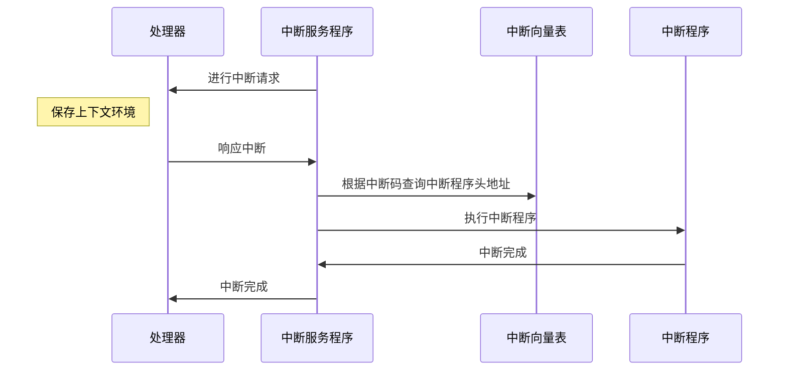

**中断向量表**

中断向量表以键值对存储： 中断向量=中断程序头地址

**中断的基本概念**

**中断函数是void类型的，既不入参，也不出参。**

| 词         | 意                                                           |
| ---------- | ------------------------------------------------------------ |
| 中断源     | 什么发出中断请求                                             |
| 中断程序   | 处理中断请求的程序，如我一个键盘中断，就有一个专门处理键盘中断的程序在内存中 |
| 中断使能   | 中断不是一开始就可以中断，要用中断使能让其运行               |
| 中断屏蔽   | 屏蔽掉一种中断请求，如我屏蔽键盘的中断请求                   |
| 中断优先级 | 中断可以分优先级，比如：硬件故障中断的优先级应该比键盘中断高？？ |
| 中断嵌套   | 有了中断优先级就有会出现，我这边一个键盘中断正在处理，突然来个电脑硬件坏了，那肯定要先处理硬件问题，这时候就保存键盘中断的上下文环境。转去处理硬件问题 |
| 中断请求   | 请求处理器进行中断                                           |
| 中断响应   | 处理器响应中断                                               |

**轮询处理方式**

不用中断程序，也可以达到处理突发事件的效果，那就是使用**轮询**的方式，但是一般没人这么干，因为缺点很大。

**缺点：**

- 响应速度慢，可能我刚判断完成，中断就来了，那就得在等一轮
- 浪费资源，不管是否有中断，每次都要进行判断，这样就浪费了资源


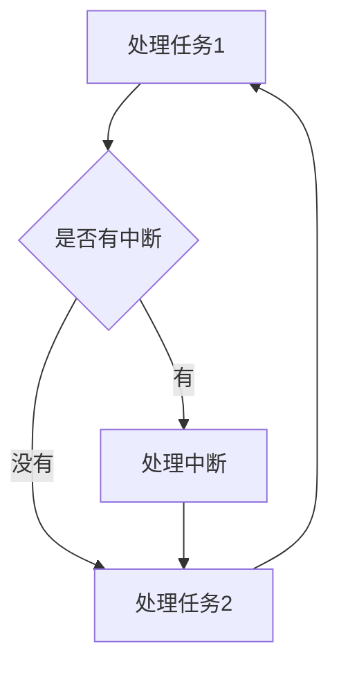


### 总线系统

总线（BUS）是计算机的各种部件连接线，作用是传输：数据、地址、电流、指令

> 若是把数据当成水，那河床就是总线。水不可能悬空流的啊，那不符合当今科学，底下总要有载体啊


**基本概念**

- **位：**计算机传输着`0`和`1`的比特流，一根线只能传输一个`0`或者`1`，一根线就相当一位
- **字：**一个`字节`八个比特组成，那八根组成`一字`
- **宽度：**总线的根数，可传输的位数，向上面的`一字`或者`16`、`32`、`64`


**总线类型**

~传输物质分类~

- **单双向：**传输的方向，双向就一根水管，既可以你传给我，也可以我传给你。单向就是只能你传

- **数据总线：**传输数据，双向。
- **地址总线：**单向，只能由CPU发出，指定信息源或目的地。有`20`根、`24`根、`32`根
- **控制总线：**单双向都有，传输一些指令，控制计算机的元器件，控制读写
- **供电总线：**专职供电几十年


~所处位置分类~

- **片内总线：**CPU芯片内的总线，CPU多核的情况下，有片内总线进行连接各个核心数
- **内部总线：**计算机里的总线，计算机的元器件之间靠内部总线维持，如：存储器到CPU之间
- **外部总线：**外部的总线，电脑提供给显示器、打印机这种对外的接口


**总线频率**

- **频率：**我简单的视为收发的速度。具体的详情参考百度词条[HZ](https://baike.baidu.com/item/HZ/7352399?fr=aladdin)

- **异步：**CPU到存储器之间拉取数据，那CPU和存储器之间的收发速度不一致，那就要进行前置交流。

  速度较慢、传输时有损耗，实现难度小

  <font color='red'>若无交流，那存储器发十次，处理器那边只接收了九次，那就会丢掉一次的数据</font>

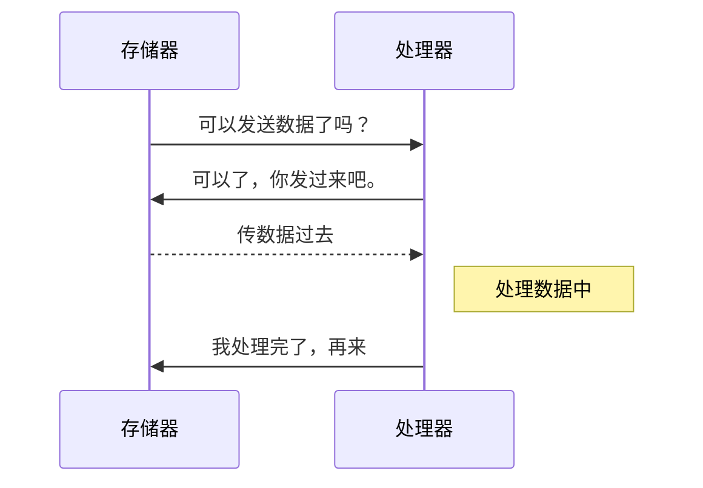

- **同步：**频率相同可进行直接进行收发。
  - 速度快、成本低，实现难度大


**总线的部署方式**

- **集中式总线：**总线控制逻辑全部集中在一处，由它进行管理，要传输时就直接去一个总线控制器，查看能否可以 传输
- **分布式总线：**总线的控制逻辑分布式在计算机各个位置，每个位置都有一个总线控制器，如：我CPU有一个总线控制器，CPU需要数据时，就需要CPU那一块的总线控制器去询问内存的总线控制器。


**总线系统的中间件**

- **总线适配器：**各个部件之间的传输数据格式不一样，需要通过总线控制器进行一个转换
- **I/O控制器：**总线与外部硬件之间传输数据的一个转换，类似鼠标、键盘这些外设都有I/O控制器。


**I/O系统软件层次结构图**

每个外设都有一个驱动，每个驱动都对接中断，然后每次外设发送指令时，都会触发中断。

**一个I/O请求会经过下图的各个层次**

|         I/O软件的层次          |
| :----------------------------: |
|     用户空间软件（应用层）     |
| 与设备无关软件（如：操作系统） |
| 驱动软件（操作系统调用的程序） |
| 中断程序（驱动会调用中断程序） |
|   硬件（打印机、鼠标、键盘）   |


**总线的性能指标**
$$
总线带宽Mb/s = 总线位宽*总线频率
$$

$$
总线带宽MB/S = (总线位宽*总线频率 /8)
$$


### I/O系统

`I/O`系统是对外部设备的一个输入输出管理，`I/O`是`input/ouput`的缩写。

外部设备是指除了`CPU`和`存储器`之外的所有设备。

**基本概念**

外部设备中包含了两类：

- **存储设备：**硬盘、磁带、光碟等
- **I/O设备：**鼠标、键盘、显示器、打印机等

**统一编址：**存储器和`I/O`设备的统一编址在一个块，CPU通过`load`和`store`指令进行操作，对主存地址发出指令就是对读写，对`I/O`地址发出指令就是向设备发出控制命令。

**独立编址：**设定专用的的`I/O`指令对`I/O`设备进行操作，根据`CPU`发出的信号判断访问的`I/O`设备地址。 读取主存就用主存指令，进行I/O就使用I/O指令。

<font color='orange'>统一编址模型</font>

|                   地址                    |
| :---------------------------------------: |
|                 主存空间                  |
| I/O空间，键盘、鼠标、显示器等各占一个位置 |

<font color='orange'>独立编址流程图，若是统一编址`CPU`出来只有一条线</font>

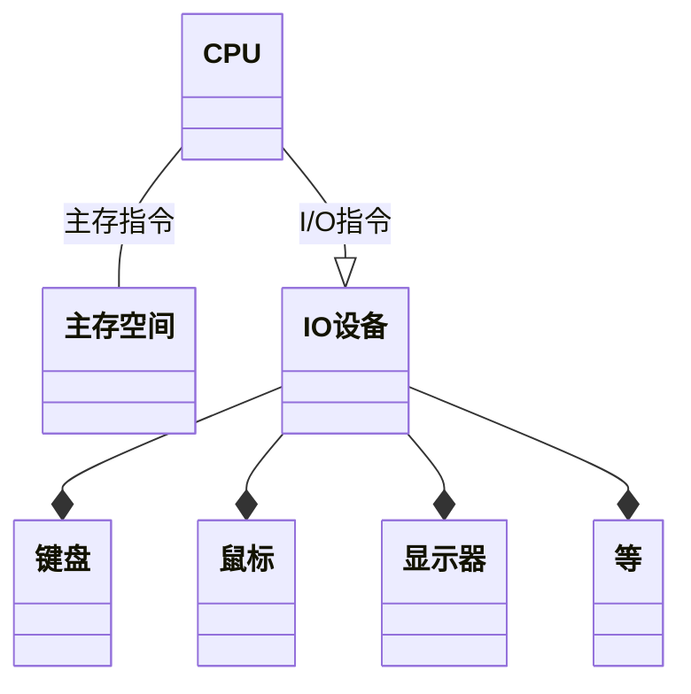


**轮询：**由程序员进行在代码判断是否有事件发生，若是有事情发送就处理事情。

**中断：**由操作系统实现中断传输数据，数据量小没问题，但是数据量大的情况,会出现大问题，因为中断嵌套，一个`I/O`进来就是一个中断，`I/O`没有完成就又来一个`I/O`，造成无限套娃

[轮询和中断的学习笔记](/自考计算机科学与技术/2021/01/29/system-structure.html)

**DMA：**DMA进行传输数据，`CPU`把主存地址、`I/O`地址、数据长度、什么时候开始传输等信息发给`DMA`，`DMA`根据`CPU`的信息开始数据传输，虽然节省了传输时间，但是`CPU`依然要寻找数据地址，寻找放置数据的主存地址等操作。

<font color='orange'>没有DCM前传输数据</font>

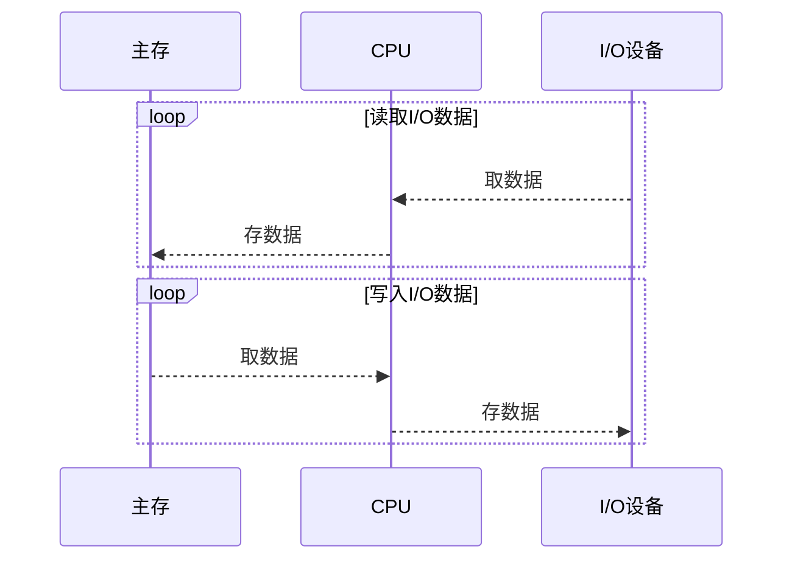

<font color='orange'>有DMA后传输数据</font>

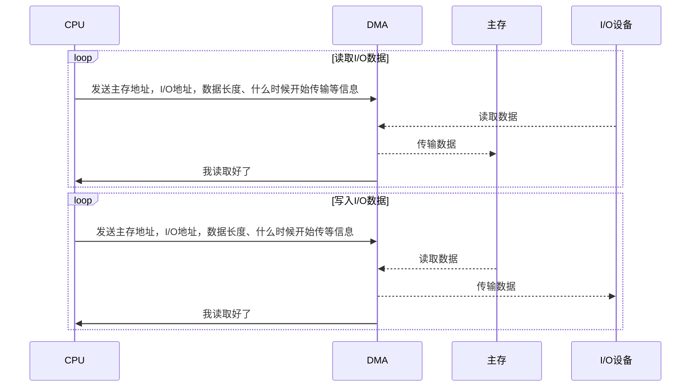


 **通道**

通道程序是由硬件实现，拥有自己的一套`I/O`指令，通过接收`CPU`的请求，对数据进行传输。

相当于`CPU`从自己身体分离了一个小弟，专门干`I/O`的事情。

通道的功能：

1. 接收`CPU`的请求，并根据指令要求选择指定外设和通道相连接
2. 执行通道程序，从主存取出通道指令，进行译码，向设备控制器发出操作命令
3. 给出读写操作的数据所在地址：磁盘存储器的柱面号、磁头号、扇区等。
4. 寻找主存的首地址，该缓冲区存放从外设读取数据或者将要输出到外设的数据
5. 控制外设与主存缓冲区之间的数据传输，对传送的数据进行计数，由此判断是否完成。
6. 指定传输结束后要进行的操作：中断请求及通道中断请求送往`CPU`等
7. 检查外设是否正常，并将该状态信息送往主存指定单元保存
8. 对传输的数据进行格式转换，如：比特流转换成字节,把字节转换为字等

<font color='orange'>使用通道导入数据过程</font>

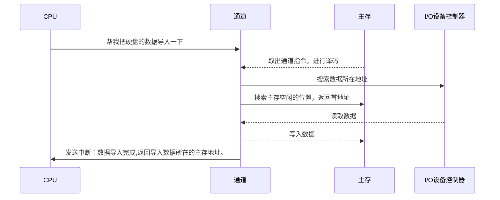


### 通道类型

**选择通道**

通道每次只服务于单台设备，高速传输完成一个设备后，再服务下一台设备，字节数传输

**字节多路通道** 

以字节为传输单位，顺序的服务多台设备，如：A、B设备都需要传输十个字节，我就连接A传一个字节，再连接B传一个字节，然后连接A传，这样轮着来

**数组多路通道**

以块为传输单位，顺序的服务多台设备，如：A、B设备都需要传输十个字节，我就连接A传一块（五个字节），再连接B传一块（五个字节），然后连接A传，这样轮着来


通道传输速率成为Bps,又称为吞吐率、通道流量，是单位时间内传输的数据量。

参数

$T_s$：设备选择时间，通道开始传输数据之前的准备时间，连接时间 。

$T_D$：通道传输一个字节需要的时间。

p：通道连接设备数，处于工作的

n：每台设备需要传输的字节数

k: 一个数据块包含的字节数，只有数组选择通道才有的参数

T: 通道完成所有数据传输的总时长


<font color='red'>`设：A、B两台设备需要传输10字节,选择时间1us，传输时间1us`</font>

**字节多路通道**

总共传输耗时：
$$
T_{Byte} = (T_s+T_D) *p * n
\\T_{Byte} = (1+1)*2*10 = 40_{us}
$$
极限流量计算公式
$$
f_{Max\_Byte} =\frac{pn}{(T_S+T_D)pn} =\frac{1}{T_S+T_D}
\\f_{Max\_Byte} =\frac{2*10}{(1+1) *2*10}= \frac{1}{1+1} =0.5
$$
实际流量是连接这个通道上所有设备的数据传输率
$$
f_{BYTE} = \sum_{i=1}^pfi
\\f_{BYTE} = \sum_{i=1}^2fi = 2*(10*2) = 40_{us}
$$
$f_i$是第i台设备实际的传输速率，j为通道号


<font color='red'>`设：A、B两台设备需要传输10字节,选择时间1us，传输时间1us。传输块的字节数为2`</font>

**数组多路通道**

总共传输耗时：
$$
T_{Bolck} = (\frac{T_s}{k}+T_D)*p*n
\\T_{Bolck} = (\frac{1}{2} + 1)*2*10 = 30_{us}
$$
极限流量计算公式
$$
f_{Max\_Bolck} =\frac{pn}{(\frac{T_s}{k}+T_D)pn}=\frac{1}{\frac{T_s}{k}+T_D}
\\f_{Max\_Bolck} = \frac{2*10}{30_{us}} = \frac{2}{3} \approx 0.6666
$$
实际流量是连接这个通道上的最大设备数据传输率
$$
f_{Bolck} = \max^{p}_{i=1}f_{i}
$$
$f_i$是第i台设备实际的传输速率，j为通道号

<font color='red'>`设：A、B两台设备需要传输10字节,选择时间1us，传输时间1us。`</font>

**选择通道**

总共传输耗时：
$$
T_{Select} = (\frac{T_s}{n}+T_D)\times p\times n
\\T_{Select} = (\frac{1}{10} + 1)\times2\times10 = 22_{us}
$$

极限流量计算公式
$$
f_{Max\_Bolck} =\frac{pn}{(\frac{T_s}{k}+T_D)pn}=\frac{1}{\frac{T_s}{k}+T_D}
\\f_{Max\_Bolck} = \frac{2*10}{22_{us}} = \frac{10}{11} \approx 0.999
$$
实际流量是连接这个通道上的最大设备数据传输率
$$
f_{select·j}  = \max^{p}_{i=1}f_{i}
$$


**通道总和流量分析**

如果`I/O`系统有m个通道，其中1至$m_1$为字节多路通道，$m+1$至$m_2$为数组多路通道，$m_2+1$至$m$为选择通道。

则该`I/O`系统的极限流量将为
$$
f_{max} = \sum^{m_1}_{j=1}f_{max\cdot byte\cdot j} +
\sum^{m_2}_{j=m_1+1}f_{max\cdot block\cdot j} +
\sum^{m}_{j=m_2+1}f_{max\cdot select\cdot j}
$$


**例题**

设有一字节多路通道，它有3个子通道: `"0"号、"1"号高速印字机各占一个子通道`；`“0”号打印机、"1"号打印机和"0"号光电输入机何用一个子通道`。假定传送期内高速印字机每隔$25_{us}$发送一个字节请求，低速打印机每隔$150_{us}$发一个字节请求，广电输入机每隔$800_{us}$发一个字节请求，则这5台设备要求通道的流量为？
$$
f_{max} = \sum^5_{i=1}f_{i\cdot j} = \frac{1}{25}+\frac{1}{25}+(\frac{1}{150}+\frac{1}{150}+\frac{1}{800}) \approx 0.095MB/s
$$


## 第四章

### 基本概念


**存储介质**

介绍的存储介质，以存储速度从快到慢进行介绍

> Register/寄存器：距离CPU最近，最快的存储介质。有如指令地址寄存器，指令寄存器等

> Cache/高速缓冲区：CPU中集成的存储介质，价格昂贵对CPU的性能影响较大

> SDRAM/内存条：随着断电数据丢失

> ROM/只读存储器：出厂前写入经常用的程序到该存储器中，通常较难更改里面的数据

> Falsh memory：读速度比存速度快

> SSD 硬盘：一块硬盘上集成多个Falsh memory

> 磁盘：一个盘上面有磁道，通过磁头的电流与磁道的磁发生反应读取数据

> 网盘/云盘：数据存储到云上面，存取速度由网速决定

**存储系统的基本要求**：速度快、价格低、容量大


主存-辅存存贮层次，从整体结构来看速度是主存，容量是辅存（DISK）。

Catch-主存存贮层次，从CPU角度来看，速度是Cache，容量的主存。

 **层次化存储系统：**

根据程序的局部性原理设计了层次化存储系统。数据在使用到时，往往旁边的数据也会被使用到。

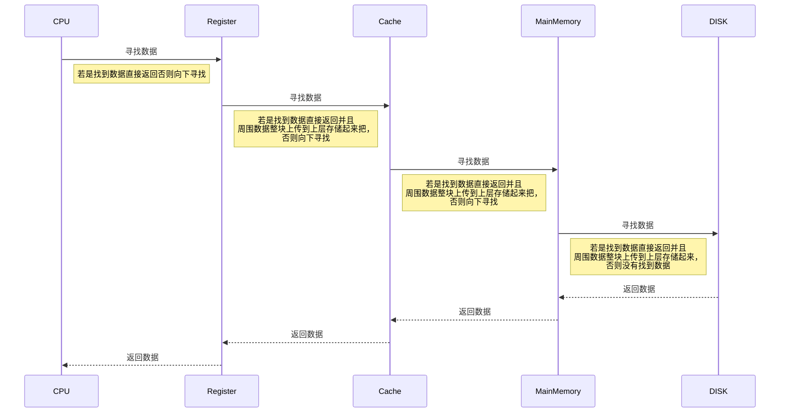

**存储层次的性能参数**

性能参数：容量S、速度TA、价格C

**每位价格**：$总价格\div总容量$
$$
C=\frac{C_1+C_2}{S_1+S2}
$$
命中率：命中就是CPU直接在寄存器找到需要的数据。命中率越高就代表算法越好。

$R_1$—访问寄存器的次数

$R_2$—访问寄存器之外的存储介质的次数

**命中率**
$$
H=\frac{R_1}{R_1+R_2}
$$
**失效率**
$$
F=1-H
$$
**平均访问时间**
$$
T_A=HT_{A_1}+(1-H)T_{A_2}
$$


### 虚拟存储器原理

**概念**

- 主存-辅存 》Main Memory - DISK。

- 虚拟存储管理方式分为页式、段式、段页式。

- 进程可分为几个部分存储在不同的（页/段）。

- 逻辑地址表示的空间就是虚拟存储空间。


**虚拟存储-部分加载**

- 运行进程的所有页/段不必都在内存里，只要保证下一条指令和下一条数据在内存中就可以。
- 进程可比内存大。（逻辑地址可比主存地址大）。因为程序的局部性原理，进程可比实际物理内存大，需要哪一部分加载进那一部分，不需要该部分就通过交换技术交换到辅存中。
- 进程可以容纳更多进程。


**虚拟存储技术的特征**

- 不连续性：物理空间不用一整个块来存储虚拟空间，虚拟空间一整块可以对应多块物理空间

- 部分交换：可以先把一部分程序先加载进主存，运行完成后，在交换剩下的部分进主存

- 大空间：$进程空间<内存+外存$


 **虚拟存储必要的支持**

- 硬件支持：CPU必须拥有存储控制单元

- 软件支持：操作系统必须支持管理内存与外存之间页/段

### 虚拟存储的页式管理

**页式管理**

若是已转入的数据需要则直接可以通过信息查询到内存地址，若是该页未装入内存，则从辅存中调入到页面中。

每个进程都有一个页表有N个，每个页的都是固定大小的存储页，如4KB。每个页面对应内存中的一块。

使用页式管理进行虚拟内存转换物理地址时需要提供：进程号、页号、页内偏移值。

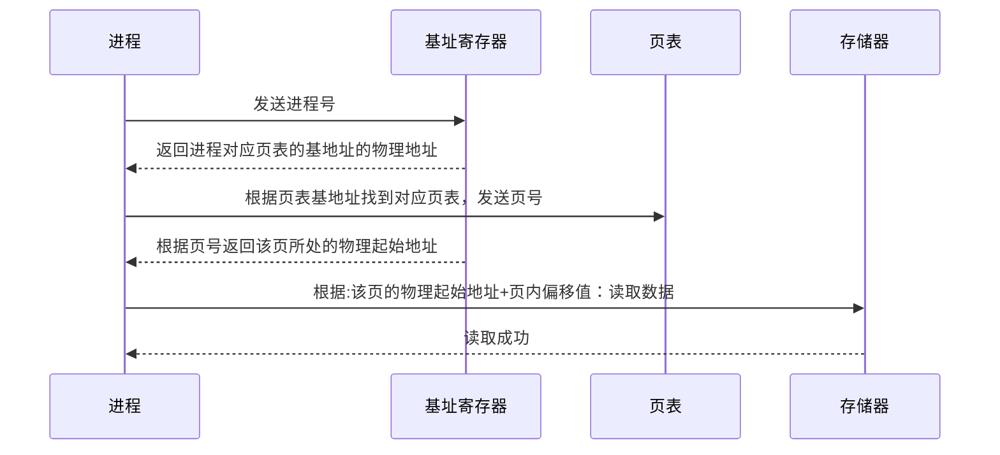

**页面替换算法**

内存就那么大，若是程序全部装入就装不下，就装入一部分，当内存装满时，就是用页面替换算法，把主存和辅存的页面进行一个替换。

**LRU算法/近期最少使用算法**：该算法是把最近最少使用的页面淘汰掉，然后从辅存中获取界面。

下图是使用近期最少使用算法的内存图，可以看出一开始先把页面1调入内存，然后把页面2调入内存，这时候要调入页面3，但是内存满了，于是我们就把页面1替换出内存，把页面三加载进来。

|      |      |      |      |      |      |
| ---- | ---- | ---- | ---- | ---- | ---- |
| 1    | 1    | 2    | 2    | 1    | 3    |
|      | 2    | 3    | 1    | 3    | 1    |


### **虚拟存储技术**

 **TLB**

> TLB也称为快表，是CPU内部存储页表的地方，通过加载进一部分页表，使得CPU读取数据更快，若是访问的地址命中，就无需访问两次主存，直接从CPU出来就是拿着物理地址访问数据

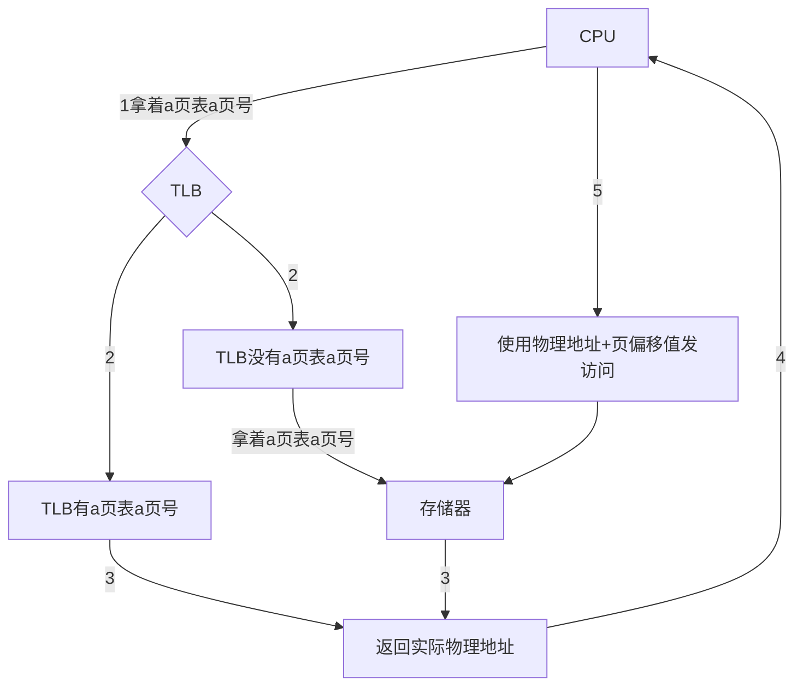


**散列TLB**是使用哈希的方式进行过滤，让查询结果只需要比对几个值就行了，无需对比页表的所有值


 **段式管理**

> 一个程序就有一个段表，段表里面有N个段，每个段大小不一，每个段都可用存储程序里的任意对象。
>
> 如：A程序里面有个方法占了一段大小为3KB,有个变量占了一段为100B。

**段式的访问过程**

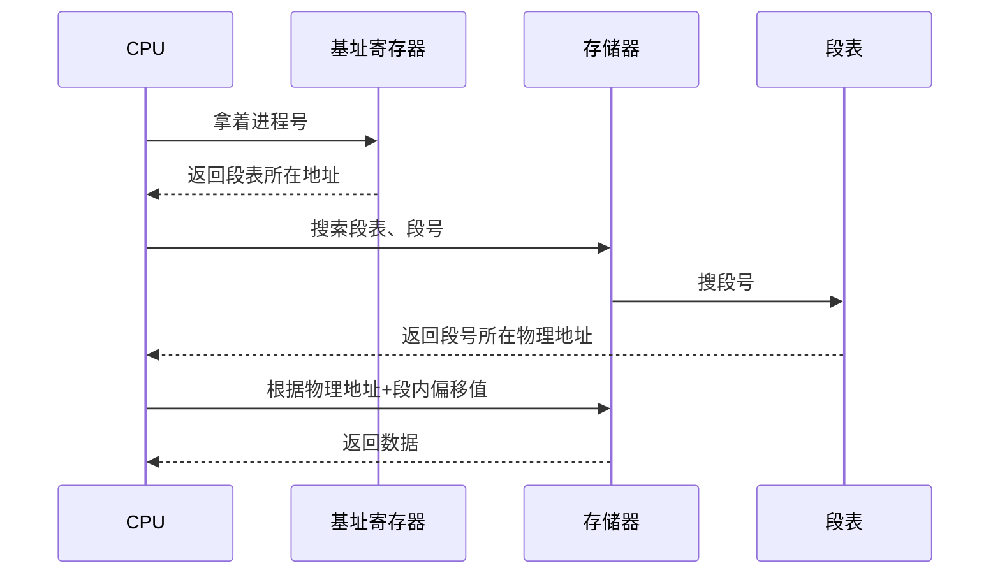


 **段页式管理**

> 段式管理的空间大小不一，显得很不规范，这时候用段页管理来解决。
>
> 段页式是把程序分成多个段，然后每个段都分页的概念。

**段页式的访问过程**

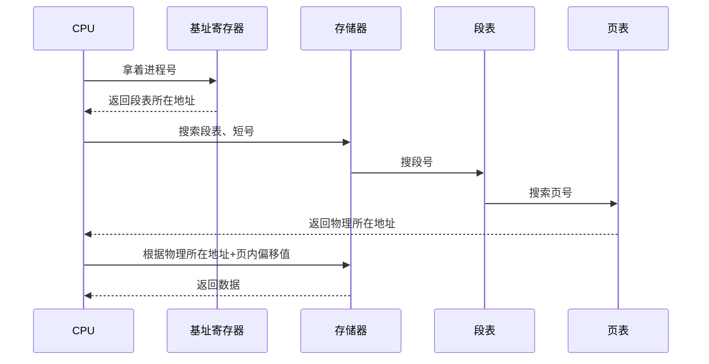


**虚拟存储器的工作流程**

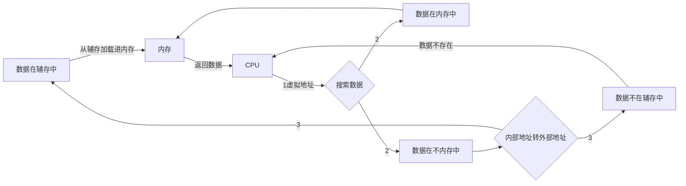


> Cache是加速CPU访问数据的一个硬件。
>
> 通过把数据预先从内存中取出来，放入Cache中存储，Cache的速度比内存快很多。CPU读取Cache的时候若是命中，速度就快
>
> 主要的四个地方：映像、替换、写入、查找


**Cache存储单元**

- 有效位字段：判断这个单元是否有效
- 标志字段：保存单元存储的数据的内存地址
- 数据字段：保存从主存中复制到单元的数据


**Cache基本运行原理**

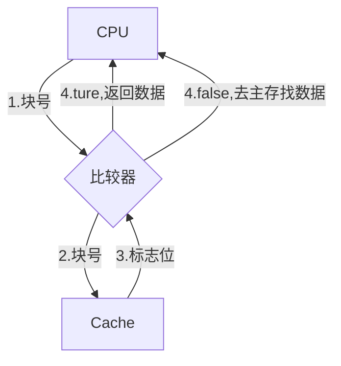


**比较器**：比较Cache的数据标志是否时CPU传递过来的值


### 高速缓冲器基础

**映像规则：全相联**

> 内存中的数据加载进Cache时可用放置在任意Cache位。
>
> 使用全相联的情况下，Cache中有几个位置就需要多少个比较器。

可用看到下图，使用全映像情况下，一个Cache单元就需要一个比较器

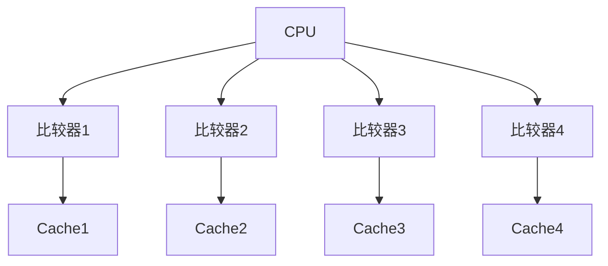

**映像规则：直接相联**

> 内存中的数据分区，然后内存数据在Cache中有固定一个单元。
>
> 放入Cache时就直接放入那个单元，哪怕其他单元空了也不能放其他单元
>
> 使用区号给内存分区，每个区与Cache相同大小。
>
> 把内存加载进Cache时，就根据数据在内存所处位置放入对应的Cache单元中。如：在内存的第一块，在Cache中也是第一块
>
> 主存地址组成：区号、块号、数据


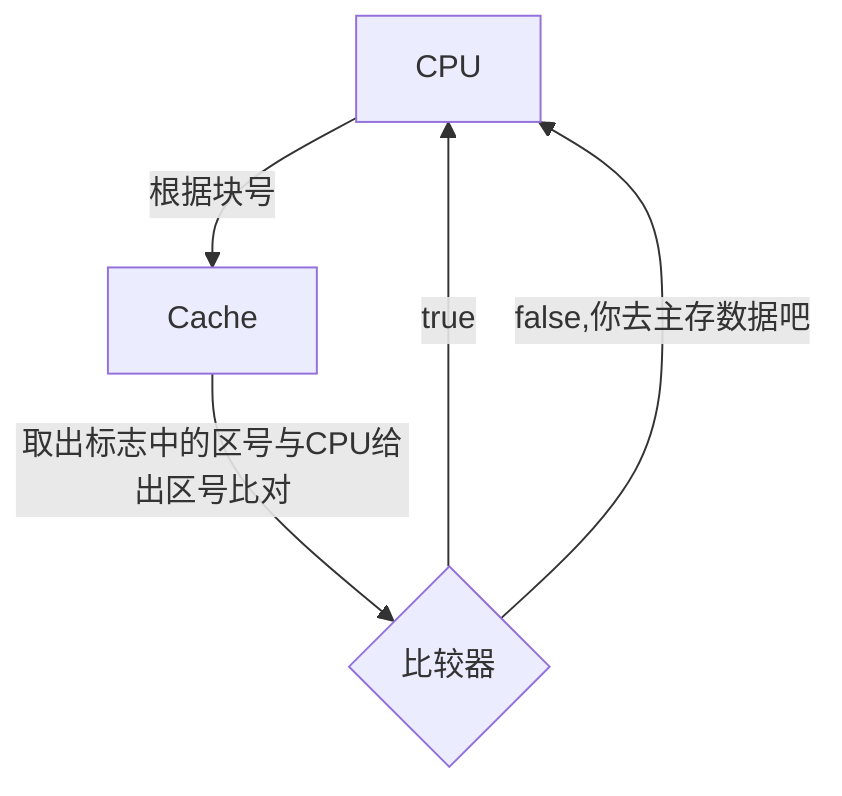


**映像规则：组相联**

> 内存中的数据分区，然后内存数据在Cache中有固定N单元。（N=组的数量）
>
> 组的数量决定了数据在Cache中的位置可选数。
>
> 若是只有一组的情况下，和直接相联时没有太大区别
>
> 主存地址组成：区号、组号、组内块号、块内地址

**下图就可用根据组号、组内块号进行取数据，然后取到数据后拿出区号进行对比。若是区号对的上，数据就去取对了。**

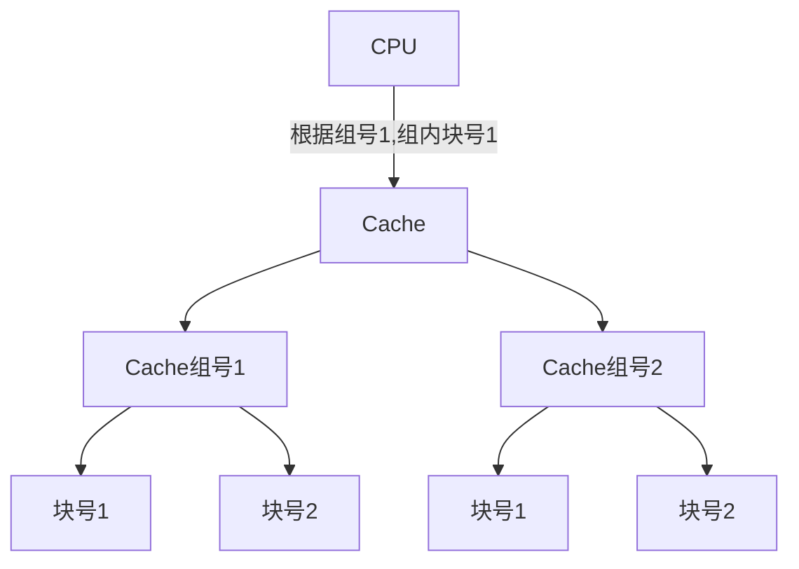


### **高速缓冲器**

**Cache的替换算法**

> 直接映像的情况下，Cache块有数据就直接替换，没有数据就把内存的数据放入其中
>
> Cache的替换算法主要是对全映像，组映像进行一个操作

**随机法：**`Cache`的空间不足时，从内存中取数据到`Cache`

**FIFO/先进先出算法:**先加载进`Cache`的数据先替换，后加载的后替换

**LRU/最近最少使用算法:**每次加载数据进`Cache`时，对最近最少使用的`Cache`块打个标记，然后`Cache`满了的时候，直接替换掉标记的`Cache`块


**写入**

> CPU写入数据到Cache的策略

**写回法：**`CPU`要写入数据到`Cache`，等数据积攒到一定量或者要替换时在写入`Memory`中

**写直达法：**`CPU`每次要写入数据到`Cache`，就把数据一起写入`Memory`中


 **一致性**

> 当CPU是多核数量的情况下，每个核都配置一个Cache。
>
> 若是CPU1对Cache1进行了修改，并且写入Memory中。
>
> CPU2中的Cache2数据没有进行更新，那就发生了数据不一致，所以需要解决。

**写作废协议（作废法）：**`CPU1`写入数据时，把`Cache2`的该数据的有效位作废

**写更新协议（播写法）：**`CPU1`写入数据时，把`Cache2`的该数据的一起更新


**缺失率：**`CPU`访问`Cache`没获取到数据的几率

- 组的数量一样时，`Cache`块的容量越大，命中率越高，缺失率越低。

- 块的容量一样时，`Cache`组的数量越多，命中率越高，缺失率越低。


**Cache性能分析**

设$t_c$为`Cache`的访问时间，$t_m$为`memory`访问时间，为访`Cache`的命中率

使用Cache提升性能的倍数:
$$
p=\frac{t_m}{t_a}=\frac{t_m}{H_c \times t_c + (1-H_c) t_m}=\frac{1}{1-(1-t_c /t_m) H_c}
$$
​		


### 三级存储体系


|                       |                     `Cache`-主存                      |                主存-辅存                 |
| :-------------------: | :---------------------------------------------------: | :--------------------------------------: |
|         目的          |               为了弥补主存的速度上不足                |          为了弥补主存容量小问题          |
|     存储管理实现      |  由硬件实现，如：北桥芯片，现在CPU把北桥做到自己体内  | 由软件实现，如：操作系统，存储分页等技术 |
|    访问速度的比值     |                        一比几                         |                 一比几百                 |
|     典型的块大小      |                       几十字节                        |              几百到几千字节              |
| `CPU`对第二级访问方式 |                      可直接访问                       |                均通过一级                |
| 失效时，`CPU`是否切换 | 不切换，可以直接访问，直接把主存的数据捣腾到`Cache`中 |               切换其他进程               |


- **物理地址`Cache`：**使用虚拟地址访问`Cache`时，需要经过虚拟地址转物理地址。

- **虚拟地址`Cache`：**直接使用虚拟地址访问`Cache`，但是需要额外的硬件来实现。
- **全`Cache`：**全部使用Cache，不用主存这些东西。现在只是一个概念，未实现。


## 第五章

### **标量处理机**

**普通流水线方式：**

> 程序线性的运行。取指令，分析指令，执行指令，是三个部件。
>
> 有一条指令就重复一次，N条重复N次。


**使用重叠的流水线方式：**

> 上图中三个部件，每次运行时都会浪费了一些性能。
>
> 如：执行指令时，分析指令和取指令的部件都不会运行，就空闲了
>
> 让它们不空闲，同时运行，就是重叠的方式。需要额外的硬件实现。
>
> 下图是一次重叠。二次重叠就是执行指令时也在分析指令。

下图就是分析指令的同时取第二次的指令。分析完指令后取指令的部件也把指令取完了，但是由于是一次重叠所以没有不在执行指令时重叠分析指令。

|         |           |             |             |
| :-----: | :-------: | :---------: | ----------- |
| 取指令k |           |             |             |
|         | 分析指令k |             |             |
|         | 取指令k+1 |  执行指令k  |             |
|         |           | 分析指令k+1 |             |
|         |           |             | 执行指令k+1 |


**流水线概念**

> 流水线就是把一个重复的过程拆分成不同的子过程。
>
> 每个子过程执行的时间尽可能相同。
>
> 然后每个子过程都使用不同的部件执行，使得这些部件重叠执行，


**时空图**

- **描述方法一：**横坐标为时间，某个时间程序执行的任务。纵坐标为空间，程序执行的子过程。
- **描述方法二：**横坐标为空间，某个时间程序执行的任务。纵坐标为时间，程序执行的子过程。


**五级流水线工作时序图**

> 下图中，每个时序就是一个锁存器，总共六个时序。
>
> 每个时序之间都有处理部件。
>
> 一个脉冲的时候，所有时序就会更新，如：一个脉冲就会进行一次译码，一次脉冲就会一次执行

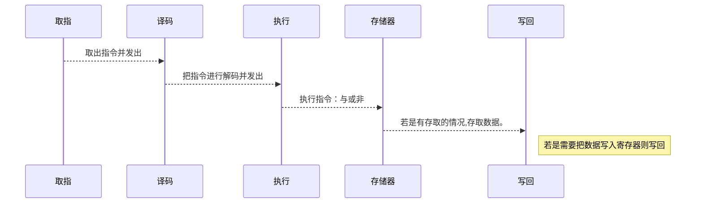

**流水线的分类**

**按处理级别分类**

> **指令流水线：**流水线以完成指令为目标

> **操作流水线：**流水线以完成操作为目标，如：乘法操作是指令的一环

> **宏流水线：**流水线以完成任务为目标，如：我需要发消息给B。我发出消息是流水线一环，B接收消息又是一环。


**按功能**

> **单功能流水线：**流水线只能处理一种操作，如只能加或乘

> **多功能流水线：**流水线可以处理多种操作，既能加也能乘

> **静态操作流水线：**多功能流水线子集。若指令A是处理加法，指令B是处理乘法，只能处理完A后才能开始B的操作。

> **动态操作流水线：**多功能流水线子集。如：指令A是处理加法，指令B是处理乘法，处理A同时准备处理B的数据。


**按流水线结构**

> **线性流水线：**任务是一条线执行。一级级的过去，没法跳过任何一级。也不会发生下一级返回到上一级的情况。

> **非线性流水线：**任务非线性，1绕过2直接就3。3也可以返回数据到1。


**按控制方式**

> **同步流水线：**

> **异步流水线：**


**按执行顺序**

> **顺序流水线：**按顺序执行指令，一条条指令执行。只有一条指令执行完才能执行下一条指令。

> **乱序流水线：**程序在指令时，可能会因为某些数据需要进入等待，等待时就现执行下一条指令。服务器一般都是用乱序


### 流水线

 **性能分析**

**吞吐率：**每秒处理任务/指令数数。

**加速比：**使用流水线和普通的顺序执行的速度差。

**效率：**指流水线设备的利用率。


**吞吐率（Through put）**

- `k`为流水线的段数。
- `t`为时钟周期。每个周期时间。
- `n`为任务数
- `TK`时流水线执行的总时长。

$$
TK = (k+n-1) \times t
$$


> 每段时间相等情况下，吞吐率计算。

$$
TP=\frac{n}{(k+n-1) t}
$$

> 每段时间不相等情况，吞吐率计算。

$$
TP=\frac{n}{\sum^k_{i=1}ti +(n-1) \max(\Delta t1,\Delta t2, ...,\Delta tk)}
$$

> 最大吞吐率：

$$
TP = \frac{n}{\max(\Delta t1, \Delta t2,..., \Delta tk)}
$$


**加速比**

> 每段时间相等的情况下，加速比计算

$$
S=\frac{顺序执行时间}{流水线执行时间} =\frac{\Delta t \times k \times n}{(k+n-1) \Delta t}=\frac{k \times n}{k+n-1}
$$

> 每段时间不相等的情况下，加速比计算

$$
S=\frac{顺序执行时间}{流水线执行时间}=\frac{n \sum^k_{i=1}ti}{\sum^k_{i=1}ti+(n-1)\max{(\Delta t_1, \Delta t_2, \ldots ,\Delta tk)}}
$$

> 最大速度比

$$
S_{max} =\frac{\sum^k_{i=1} \Delta ti}{\max(\Delta t1,\Delta t2,...,\Delta tk)}
$$

**效率**

> 每段时间相等的情况下，效率计算

$$
S=\frac{n个任务占用时空区}{k个流水段占用时空区} =\frac{\Delta t \cdot  k \cdot  n}{k \cdot (k+n-1) \cdot \Delta t}=\frac{ n}{k+n-1}
$$

> 每段时间不相等的情况下，效率计算

$$
S=\frac{顺序执行时间}{流水线执行时间}=\frac{n \sum^k_{i=1}ti}{k \cdot [\sum^k_{i=1}ti+(n-1)\max{(\Delta t_1, \Delta t_2, \ldots ,\Delta tk)]}}
$$

> 最高效率

$$
S_{max} =\frac{\sum^k_{i=1} \Delta ti}{\max(\Delta t1,\Delta t2,...,\Delta tk)}
$$

**流水线子进程执行时间不相等解决办法：**

> 一个五级流水线，各子进程执行效率如下：
>
> 子进程1=1秒，子进程2=2秒，子进程3=1秒，子进程4=1秒，子进程5=1秒。
>
> 可以看出上方子进程的执行时间与其他子进程不同。
>
> 若是执行到子进程2时，子进程1就需要等待2执行完成，这样就陷入了性能瓶颈。

**细分瓶颈段：**把子进程2拆分成两个1秒的子进程。

**重复设置重复段：**多设置一个子进程2的执行部件，这样就可以流水线方式执行。


**冲突/相关/Hezard**

- **结构Hezard：**流水线在运行过程中，因为某个流水段周期过长导致流水线出现暂停（流水线气泡）
- **数据Hezard：**流水线的运行过程中，流水线后面程序段需要等待前段的执行结果，如：加法需要等待前数。
- **控制Hezard：** 判断语句，需要等待判断语句判断后才确定走条路径。


**加法流水线执行过程**

> ADD R1,R2,R3

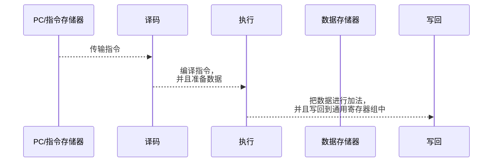


**load操作流水线过程**

> LD R4,R5(0)

```mermaid
sequenceDiagram
	participant PC/指令存储器
	participant 译码
	participant 执行
	participant 数据存储器
	participant 写回
	PC/指令存储器-->>译码: 传输指令
	译码-->>执行: 编译指令，把寄存器R5的值<br/>取出来。
	执行-->>数据存储器: 把R5的值+0，然后当成<br/>地址取数据存储器数据
	数据存储器-->>写回: 把取出的数据写回到寄存器中
```

**解决办法**

- **插入暂停周期：**就是若是产生冲突，就把后面来的暂停掉，等前面的处理完在继续处理后面的。

- **分解组件：**设置独立的指令存储器和独立的数据存储器。独立指令Cache和独立的数据Cache。


**数据Hezard**

- <font color='red'>**写后读：**</font>这个是很容易出现后问题。
- **读后写：**
- **写后写：**
- **读后读：**没得问题


**定向技术Bypass**

> 解决数据Hezard问题。
>
> 这种技术就叫做Bypass技术。关键思路就是：在某条指令的产生计算结果之前，其他指令并不真正立即需要计算结果。如果能够讲该计算结果从其产生的地方直接送往需要的地方，就可以避免停顿了。
>
> 可以看出下方周期处于3的时候，第二个任务需要取C的数据。
>
> 我们从整体可以看到周期5的时候C的结果会改变，所以第二个任务取到C的值是错误的。
>
> 解决这个问题方法：
>
> 执行周期3的时候，第一个任务执行完成后，直接把结果送给第二个任务的，这样第二个任务第四周期可以拿到正确的C值来做运算了。

| 1        | 2                          | 3                      | 4                | 5                | 6          |
| -------- | -------------------------- | ---------------------- | ---------------- | ---------------- | ---------- |
| 取出指令 | 解释指令，并且取出数据A和B | 执行A+B                | 存储置空，不操作 | 把结果赋值给C    |            |
|          | 取指令                     | 解释指令，并且取出C和D | 执行C-D          | 存储置空，不操作 | 把结果写回 |
|          |                            |                        |                  |                  |            |
|          |                            |                        |                  |                  |            |


**控制Hezard**

> 控制语句在判断分支之前，提前加载指令，可能会出现加载了错误指令。这就导致控制Hezard

**解决办法**

- **提前判断：**因为之前判断是在存储阶段，把这个判断提前到译码阶段。这样就只浪费一个周期。

- **延迟槽技术：**把代码放入延迟槽中，延迟执行。
  - **从前调度：**把判断语句之前，执行了不会影响其他指令的指令放入延迟槽中，然后在判断时就执行该指令
  - **从目标处调度**：直接把判断结果为True处的指令放入延迟槽。进行译码，然后等结果看看是否蒙对。
  - **从失败处调度**：直接把判断结果为False处的指令放入延迟槽。进行译码，然后等结果看看是否蒙对。


### 指令级并行


 **超标量处理器**

> 之前的标量处理机只有一个部件，每次只能处理一个指令。等这条指令处理完成后才能处理下一条指令。
>
> 超标量处理机则不同，它有多个部件，它可以同时处理多条指令。

**标量处理机**

|      |      |      |      |      |      |
| ---- | ---- | ---- | ---- | ---- | ---- |
| 取指 | 译码 | 执行 | 存储 | 写回 |      |
|      | 取指 | 译码 | 执行 | 存储 | 写回 |
|      |      |      |      |      |      |

**超标量处理机**

|      |      |      |      |      |      |
| ---- | ---- | ---- | ---- | ---- | ---- |
| 取指 | 译码 | 执行 | 存储 | 写回 |      |
| 取指 | 译码 | 执行 | 存储 | 写回 |      |
|      | 取指 | 译码 | 执行 | 存储 | 写回 |
|      | 取指 | 译码 | 执行 | 存储 | 写回 |


 **超长指令字**

> 通过编译器对指令进行分析，分析哪些指令可以并行执行，然后把这些指令拼接成一条新的指令，然后扔给CPU去执行。
>
> CPU对根据这条指令，然后调用不同部件，执行不同的指令。（这是多条指令同时执行）

**超级流水线**

> 一个时钟周期执行多个操作，比如我把取指在进行细分切成A、B两个操作，然后然后在一个周期的时候先指令1的取指AB操作，然后在同一个周期执行A操作。这样就尽可能的不浪费资源，


## 第六章

### 向量处理机

> **向量处理器由向量数据表示的处理机**

**时间重叠：**向量处理机

**资源重叠：**阵列处理机


**向量：**一个方向的量叫做向量，它通常指向一个值。这个值是可以改变的。

> 向量处理机的向量有六十四个值,每个向量的值通过下标来取数据


如：$D=A\times(B+C)$

上题中有个四个向量，每个都有六十四个值。

**纵向计算：**先把全部B+C的结果算出来->缓存结果->拿结果与A进行相乘->送给C

> 注意，它是先把$B_1$到$B_{64}$和 $C_1$到$C_{64}$全部进行相加。而不是加一次就进行一次乘法
>
> 这样做的好处是不会产生冲突，因为A$\times$(B+C)的时候，A需要等B+C算出来先。若是纵向就不用。

**横向计算：**B+C->得到结果->A+结果->放入C

> 普通的水平计算就是横向计算


**V冲突：**向量处理器在不能同时使用同一个V寄存器组。会产生冲突。

**功能冲突：**一个处理器的一个功能一次只能有一个流水线。如：乘法功能只能起一个乘法。若是之后有乘法就要等之前的乘法结束才能再起


**链接：**让一个B+C的结果出来后，立马和A进行相乘。而不是A傻傻的等全部B+C加完，在相乘

以$D=A\times(B+C)$为例子

```mermaid
graph TD;
	1.准备B和C数据-->2.B+C;
	2.B+C--> 3.结果与A相乘;
	2.A缓冲进寄存器-->3.结果与A相乘;
	3.结果与A相乘-->写入D
```


### 阵列处理机


**阵列处理机**

**阵列处理机原理：**阵列处理机/SIMD

> 通过资源重复的方式提升运算速度。
>
> 单指令流多数据流。
>
> 利用并行性的同时，而不是并发
>
> 可扩展性好，通过增加处理单元来进行扩展

比如：豆子在地上，我要把豆子装进麻袋中，只有两个人的情况。

**时间重复:**一个人把麻袋口撑开，一个n人把豆子集中装进麻袋。分工不同，人越多分工越细。时间上是重复的。

**资源重复：**上面只有两个人，若是豆子多的情况下那就比较难办。那就多叫几个人。这样就是资源重复。


**分布式存贮处理器：**

> 一个分布式存贮处理器有多个处理单元，每个处理单元都有增加的存贮单元，存贮需要计算机的数据。当控制器收到一条指令,对指令进行解析然后把数据和操作发给处理单元去执行。处理单元同时执行操作只能一样，加就全部加，减就全部减。

```mermaid
graph LR
	控制器-->存贮单元1
	控制器-->存贮单元2
	控制器-->存贮单元3
	存贮单元1-->处理单元1
	存贮单元2-->处理单元2
	存贮单元3-->处理单元3
	处理单元1-->控制总线:给处理单元数据共享
	处理单元2-->控制总线:给处理单元数据共享
	处理单元3-->控制总线:给处理单元数据共享
	处理单元1-->数据总线:数据对外统一输出
	处理单元2-->数据总线:数据对外统一输出
	处理单元3-->数据总线:数据对外统一输出
	数据总线:数据对外统一输出-->I/O接口
	I/O接口-->主存
	控制器<-->I/O接口
```

**集中式共享存贮器并行处理：**

> 一个集中式共享存贮器并行处理器有多个处理单元，多个处理单元共用一个存贮器。

```mermaid
graph TD
	控制器<-->主存
	控制器-->处理单元1
	控制器-->处理单元2
	控制器-->处理单元3
	处理单元1-->集中式共享存贮器:给处理单元数据共享
	处理单元2-->集中式共享存贮器:给处理单元数据共享
	处理单元3-->集中式共享存贮器:给处理单元数据共享
	集中式共享存贮器:给处理单元数据共享-->I/O接口
	主存<-->I/O接口
```


**下图是一个整列处理机**

> 整理处理机难点在于数据通信。
>
> 如处理单元0要给处理单元10传数据。蓝线步骤。
>
> 若是0和4之间没有连线的话，红线步骤。这就会导致浪费时间。
>
> 拿这样可以0和其他处理单元都连一条线吗？答案是不行的。电路太复杂了。


