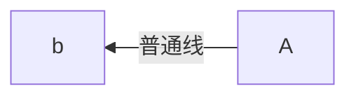

## 流程图

写博客的时候是使用`Typora`工具编写，`Typora`工具可以绘制`mermaid`流程图，但是上传到`GIthub Pages`就不支持，不会对流程图进行一个渲染，所以进行一个扩展。

### 原因

- `kramdown`渲染引擎没有实现对`mermaid`语法的渲染成流程图，只是渲染成代码块


### 思路

- 引入`mermaid`的`js`文件
- 使用`Jquery`语句对`mermaid`的代码块进行转换，转换成`mermaid的js`渲染的`div`


#### 引入`js`

[mermaid](https://www.bootcdn.cn/mermaid/) - 猫云的`mermaid`项目地址，有各个版本`mermaid`需要引入的文件

我引入的7.1.2的版本

```javascript
<script src="https://cdn.bootcdn.net/ajax/libs/mermaid/7.1.2/mermaid.core.js"></script>
<script src="https://cdn.bootcdn.net/ajax/libs/mermaid/7.1.2/mermaid.js"></script>
<script src="https://cdn.bootcdn.net/ajax/libs/mermaid/7.1.2/mermaid.min.js"></script>
```


#### 替换代码块

由于`kramdown`渲染引擎只是渲染成代码块，并不能变成`mermaid`需要的`div`,所以使用`js`进行一个替换

<font color='red'>注意：</font>

<font color='red'>这个替换`js`不要写在头部，写在尾部。</font>

<font color='red'>因为写在头部的时候文章还没渲染出来，所以替换失败</font>

```javascript
<script type="text/javascript">
        $('.language-mermaid').each(function() {
            $(this).unwrap()
            $(this).replaceWith( "<div class=\"mermaid\">" + $(this).html() + "</div>" );
    });
</script>
```


附上`mermaid`语法编写的流程图

