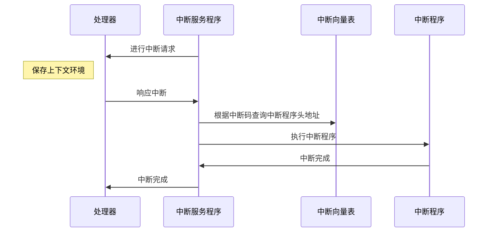
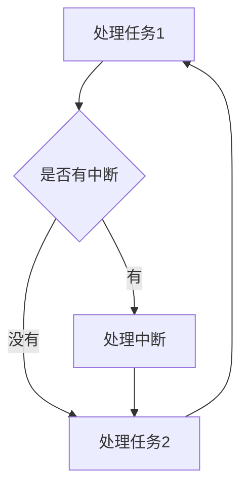

## 中断系统

中断是一个系统中极其重要的功能，把操作系统比喻为一个人的话，人的一天的一天中总有一两件突发事件。人对这种触发事件的处理就相当于中断系统的处理。

### 中断过程

### 中断向量表

中断向量表以键值对存储： 中断向量=中断程序头地址

### 中断的基本概念

**中断函数是void类型的，既不入参，也不出参。**

| 词         | 意                                                           |
| ---------- | ------------------------------------------------------------ |
| 中断源     | 什么发出中断请求                                             |
| 中断程序   | 处理中断请求的程序，如我一个键盘中断，就有一个专门处理键盘中断的程序在内存中 |
| 中断使能   | 中断不是一开始就可以中断，要用中断使能让其运行               |
| 中断屏蔽   | 屏蔽掉一种中断请求，如我屏蔽键盘的中断请求                   |
| 中断优先级 | 中断可以分优先级，比如：硬件故障中断的优先级应该比键盘中断高？？ |
| 中断嵌套   | 有了中断优先级就有会出现，我这边一个键盘中断正在处理，突然来个电脑硬件坏了，那肯定要先处理硬件问题，这时候就保存键盘中断的上下文环境。转去处理硬件问题 |
| 中断请求   | 请求处理器进行中断                                           |
| 中断响应   | 处理器响应中断                                               |

### 轮询处理方式

不用中断程序，也可以达到处理突发事件的效果，那就是使用**轮询**的方式，但是一般没人这么干，因为缺点很大。

**缺点：**

- 响应速度慢，可能我刚判断完成，中断就来了，那就得在等一轮
- 浪费资源，不管是否有中断，每次都要进行判断，这样就浪费了资源

