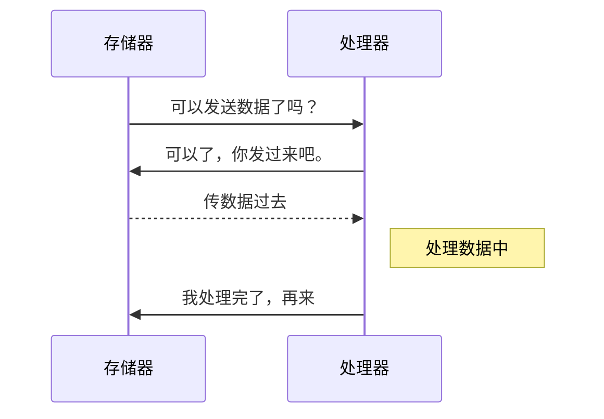

## 总线系统

总线（BUS）是计算机的各种部件连接线，作用是：传输数据、地址、电流、指令

> 若是把数据当成水，那河床就是总线。水不可能悬空流的啊，那不符合当今科学，底下总要有载体啊

### 基本概念

- **位：**计算机传输着`0`和`1`的比特流，一根线只能传输一个`0`或者`1`，一根线就相当一位
- **字：**一个`字节`八个比特组成，那八根组成`一字`
- **宽度：**总线的根数，可传输的位数，向上面的`一字`或者`16`、`32`、`64`

### 总线类型

**传输物质分类**

- **数据总线：**传输数据
- **地址总线：**传输地址，由于计算机地址长度偏长，所以总线宽度较大，一般为`32`,`64`
- **控制总线：**传输一些指令，控制计算机的元器件
- **供电总线：**专职供电几十年

**所处位置分类**

- **片内总线：**CPU芯片内的总线，CPU多核的情况下，有片内总线进行连接各个核心数
- **内部总线：**计算机里的总线，计算机的元器件之间靠内部总线维持，如：存储器到CPU之间
- **外部总线：**外部的总线，电脑提供给显示器、打印机这种对外的接口

### 总线频率

- **频率：**我简单的视为收发的速度。具体的详情参考百度词条[HZ](https://baike.baidu.com/item/HZ/7352399?fr=aladdin)

- **异步：**CPU到存储器之间拉取数据，那CPU和存储器之间的收发速度不一致，那就要进行前置交流。

  若无交流，那存储器发十次，处理器那边只接收了九次，那就会丢掉一次的数据

- **同步：**频率相同可进行直接进行收发。

### 总线的部署方式

- **集中式总线：**总线控制逻辑全部集中在一处，由它进行管理，要传输时就直接去一个总线控制器，查看能否可以 传输

- **分布式总线：**总线的控制逻辑分布式在计算机各个位置，每个位置都有一个总线控制器，如：我CPU有一个总线控制器，CPU需要数据时，就需要CPU那一块的总线控制器去询问内存的总线控制器。

### 总线系统的中间件

- **总线适配器：**各个部件之间的传输数据格式不一样，需要通过总线控制器进行一个转换
- **I/O控制器：**总线与外部硬件之间传输数据的一个转换，类似鼠标、键盘这些外设都有I/O控制器。

### I/O系统软件层次结构图

每个外设都有一个驱动，每个驱动都对接中断，然后每次外设发送指令时，都会触发中断。

**一个I/O请求会经过下图的各个层次**

|         I/O软件的层次          |
| :----------------------------: |
|     用户空间软件（应用层）     |
| 与设备无关软件（如：操作系统） |
| 驱动软件（操作系统调用的程序） |
| 中断程序（驱动会调用中断程序） |
|   硬件（打印机、鼠标、键盘）   |

### 总线的性能指标

$$
总线带宽Mb/s = 总线位宽*总线频率
$$

$$
总线带宽MB/S = (总线位宽*总线频率 /8)
$$

