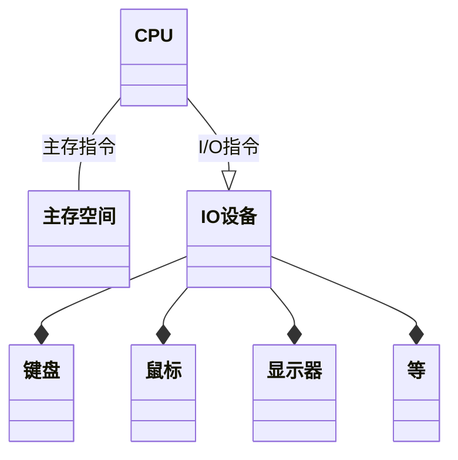
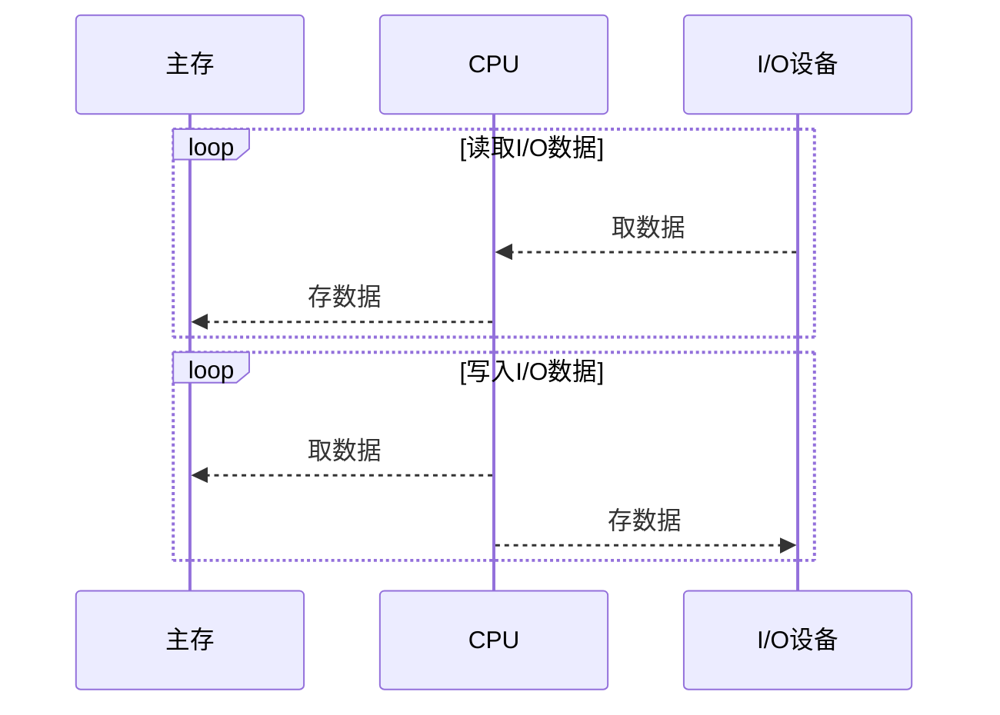
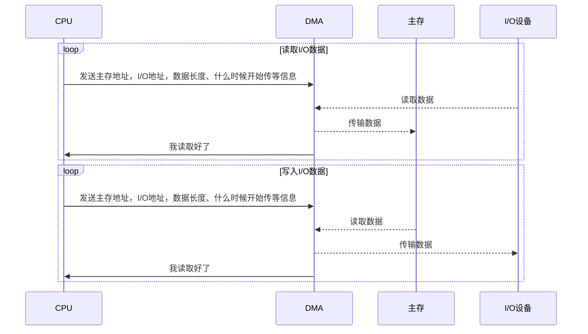
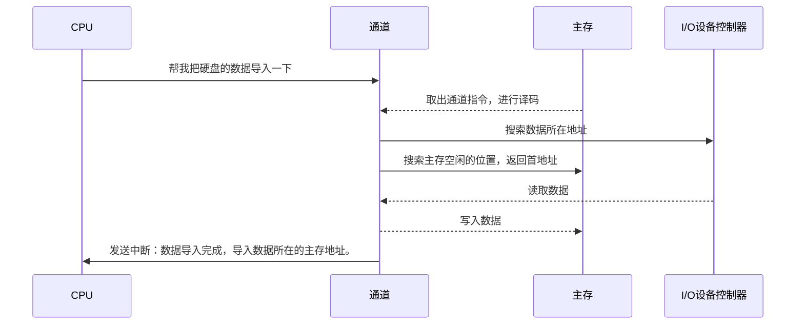

`I/O`系统是对外部设备的一个输入输出管理，`I/O`是`input/ouput`的缩写。

外部设备是指除了`CPU`和`存储器`之外的所有设备。

## 基本概念

外部设备中包含了两类：

- **存储设备：**硬盘、磁带、光碟等
- **I/O设备：**鼠标、键盘、显示器、打印机等

**统一编址：**存储器和`I/O`设备的统一编址在一个块，CPU通过`load`和`store`指令进行操作，对主存地址发出指令就是对读写，对`I/O`地址发出指令就是向设备发出控制命令。

**独立编址：**设定专用的的`I/O`指令对`I/O`设备进行操作，根据`CPU`发出的信号判断访问的`I/O`设备地址。 读取主存就用主存指令，进行I/O就使用I/O指令。

统一编址模型

|                   地址                    |
| :---------------------------------------: |
|                 主存空间                  |
| I/O空间，键盘、鼠标、显示器等各占一个位置 |

独立编址流程图，若是统一编址`CPU`出来只有一条线

**轮询：**由程序员进行在代码判断是否有事件发生，若是有事情发送就处理事情。

**中断：**由操作系统实现中断传输数据，数据量小没问题，但是数据量大的情况,会出现大问题，因为中断嵌套，一个`I/O`进来就是一个中断，`I/O`没有完成就又来一个`I/O`

[轮询和中断的学习笔记](自考计算机科学与技术/2021/01/29/system-structure.html)

**DMA：**DMA进行传输数据，`CPU`把主存地址、`I/O`地址、数据长度、什么时候开始传等信息发给`DMA`，`DMA`进行数据传输，虽然节省了传输时间，但是寻找数据地址，寻找放置数据的主存地址都要CPU去执行，就浪费了一些性能。

没有DCM前传输数据

有DMA后传输数据

## **通道**

通道程序是由硬件实现，拥有自己的一套`I/O`指令，通过接收`CPU`的请求，对数据进行传输。

相当于`CPU`从自己身体分离了一个小弟，专门干`I/O`的事情。

通道的功能：

1. 接收`CPU`的请求，并根据指令要求选择指定外设和通道相连接
2. 执行通道程序，从主存取出通道指令，进行译码，向设备控制器发出操作命令
3. 给出读写操作的数据所在地址：磁盘存储器的柱面号、磁头号、扇区等。
4. 寻找主存的首地址，该缓冲区存放从外设读取数据或者将要输出到外设的数据
5. 控制外设与主存缓冲区之间的数据传输，对传送的数据进行计数，由此判断是否完成。
6. 指定传输结束后要进行的操作：中断请求及通道中断请求送往`CPU`等
7. 检查外设是否正常，并将该状态信息送往主存指定单元保存
8. 对传输的数据进行格式转换，如：比特流转换成字节,把字节转换为字等

使用通道导入数据过程

