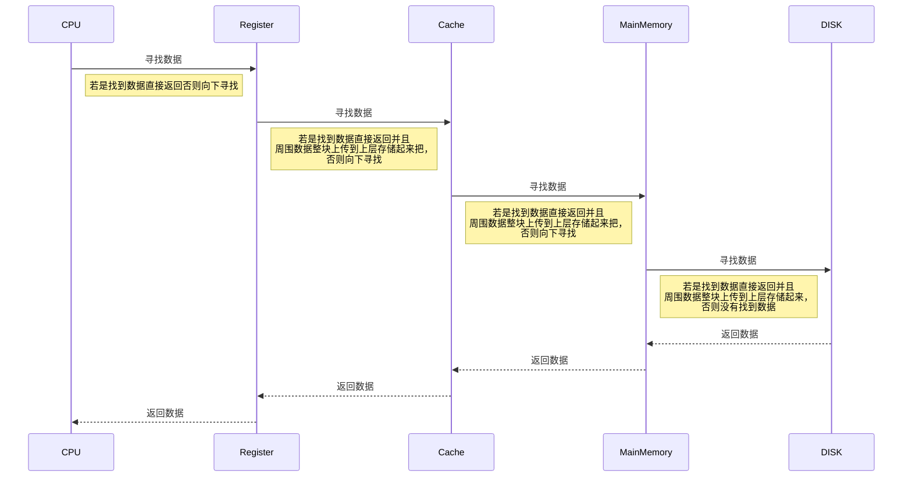

## **存储介质**

介绍的存储介质，以存储速度从快到慢进行介绍

> Register/寄存器：距离CPU最近，最快的存储介质。有如指令地址寄存器，指令寄存器等

> Cache/高速缓冲区：CPU中集成的存储介质，价格昂贵对CPU的性能影响较大

> SDRAM/内存条：随着断电数据丢失

> ROM/只读存储器：出厂前写入经常用的程序到该存储器中，通常较难更改里面的数据

> Falsh memory：读速度比存速度快

> SSD 硬盘：一块硬盘上集成多个Falsh memory

> 磁盘：一个盘上面有磁道，通过磁头的电流与磁道的磁发生反应读取数据

> 网盘/云盘：数据存储到云上面，存取速度由网速决定

**存储系统的基本要求**：速度快、价格低、容量大

主存-辅存存贮层次，从整体结构来看速度是主存，容量是辅存（DISK）。

Catch-主存存贮层次，从CPU角度来看，速度是Cache，容量的主存。

## **层次化存储系统：**

根据程序的局部性原理设计了层次化存储系统。数据在使用到时，往往旁边的数据也会被使用到。

## 存储层次的性能参数

性能参数：容量S、速度TA、价格C

**每位价格**：$总价格\div总容量$
$$
C=\frac{C_1+C_2}{S_1+S2}
$$
命中率：命中就是CPU直接在寄存器找到需要的数据。命中率越高就代表算法越好。

$R_1$—访问寄存器的次数

$R_2$—访问寄存器之外的存储介质的次数

**命中率**
$$
H=\frac{R_1}{R_1+R_2}
$$
**失效率**
$$
F=1-H
$$
**平均访问时间**
$$
T_A=HT_{A_1}+(1-H)T_{A_2}
$$
