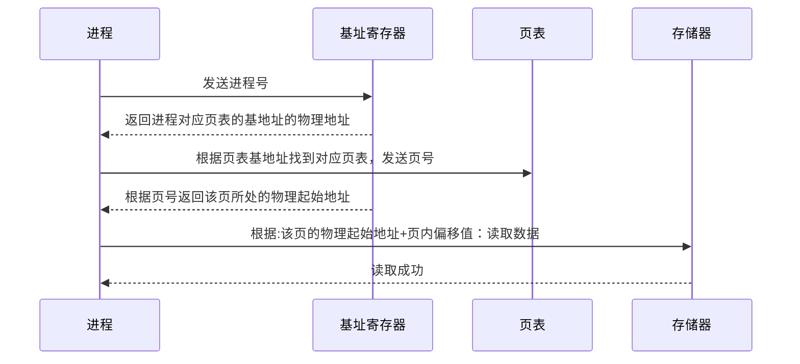

### 页式管理

若是已转入的数据需要则直接可以通过信息查询到内存地址，若是该页未装入内存，则从辅存中调入到页面中。

每个进程都有一个页表有N个，每个页的都是固定大小的存储页，如4KB。每个页面对应内存中的一块。

使用页式管理进行虚拟内存转换物理地址时需要提供：进程号、页号、页内偏移值。

### 页面替换算法

内存就那么大，若是程序全部装入就装不下，就装入一部分，当内存装满时，就是用页面替换算法，把主存和辅存的页面进行一个替换。

**LRU算法/近期最少使用算法**：该算法是把最近最少使用的页面淘汰掉，然后从辅存中获取界面。

下图是使用近期最少使用算法的内存图，可以看出一开始先把页面1调入内存，然后把页面2调入内存，这时候要调入页面3，但是内存满了，于是我们就把页面1替换出内存，把页面三加载进来。

|      |      |      |      |      |      |
| ---- | ---- | ---- | ---- | ---- | ---- |
| 1    | 1    | 2    | 2    | 1    | 3    |
|      | 2    | 3    | 1    | 3    | 1    |

