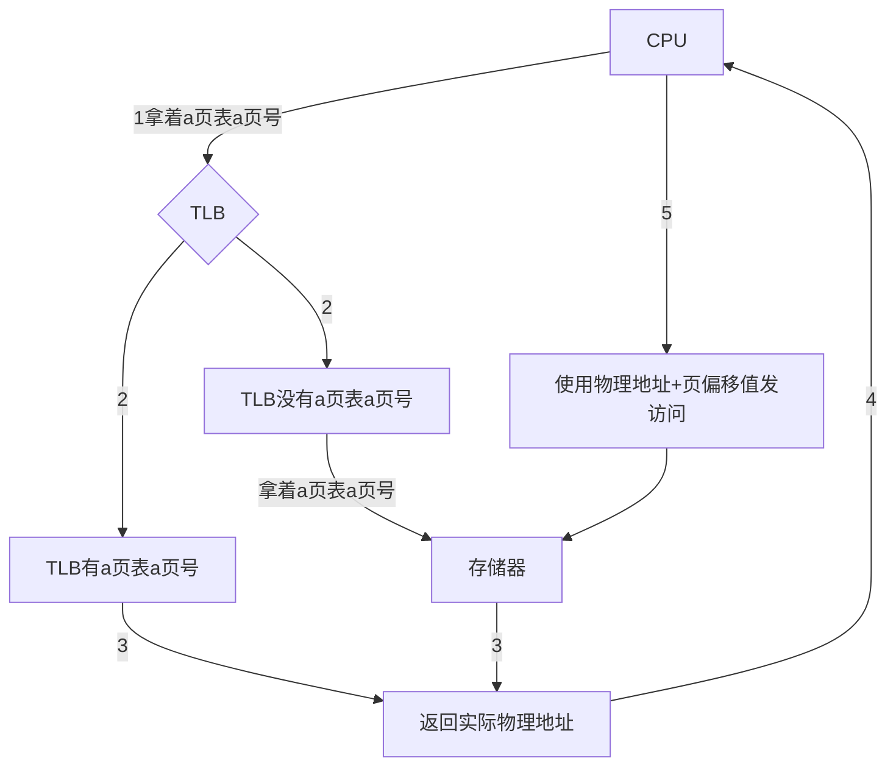
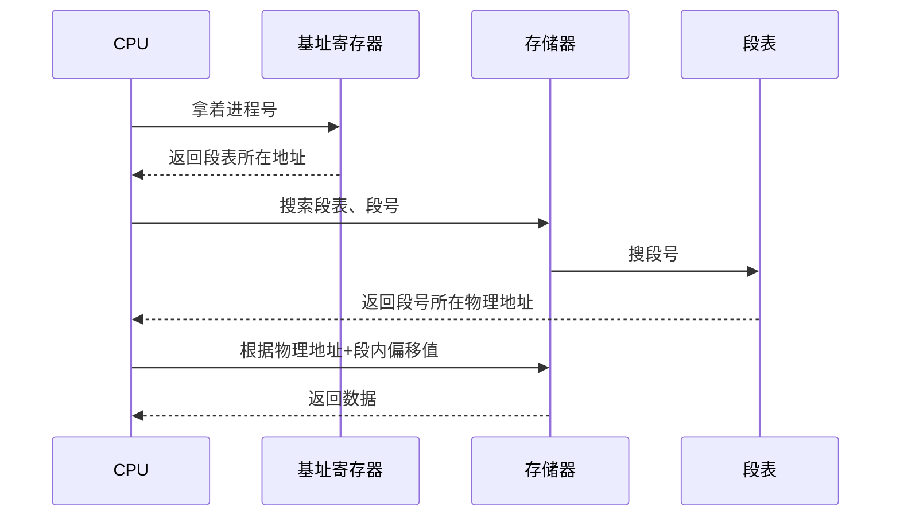
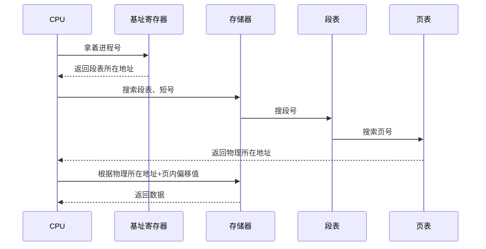
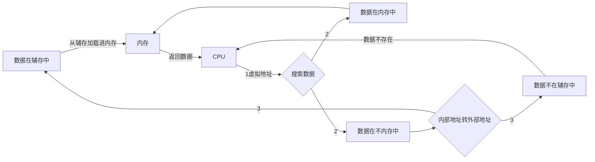

### **TLB**

> TLB也称为快表，是CPU内部存储页表的地方，通过加载进一部分页表，使得CPU读取数据更快，若是访问的地址命中，就无需访问两次主存，直接从CPU出来就是拿着物理地址访问数据

**散列TLB**是使用哈希的方式进行过滤，让查询结果只需要比对几个值就行了，无需对比页表的所有值

### **段式管理**

> 一个程序就有一个段表，段表里面有N个段，每个段大小不一，每个段都可用存储程序里的任意对象。
>
> 如：A程序里面有个方法占了一段大小为3KB,有个变量占了一段为100B。

**段式的访问过程**

### 段页式管理

> 段式管理的空间大小不一，显得很不规范，这时候用段页管理来解决。
>
> 段页式是把程序分成多个段，然后每个段都分页的概念。

**段页式的访问过程**

### 虚拟存储器的工作流程

