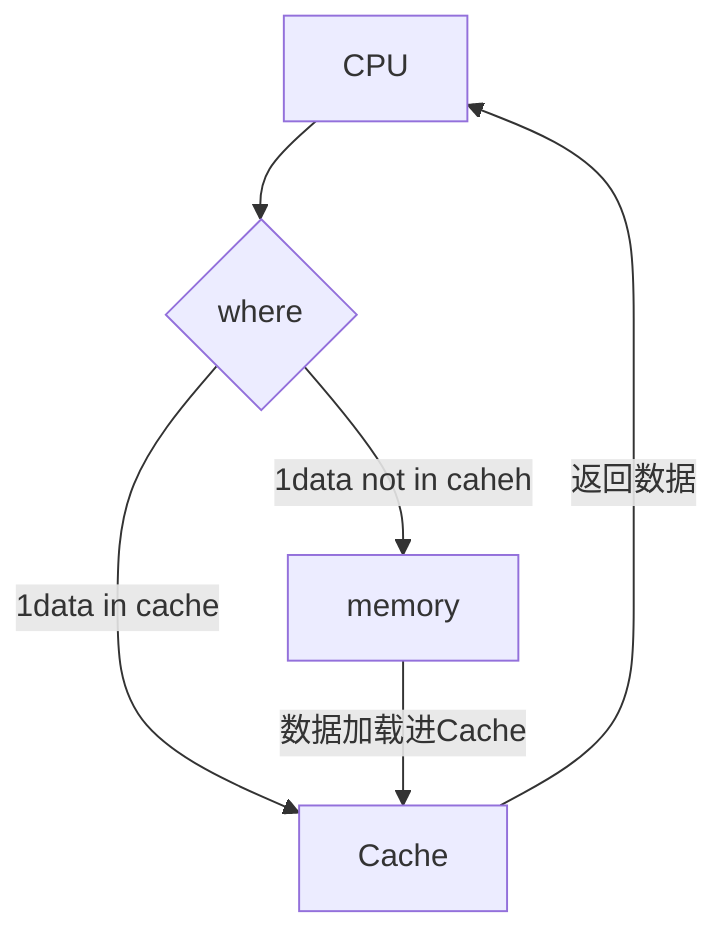
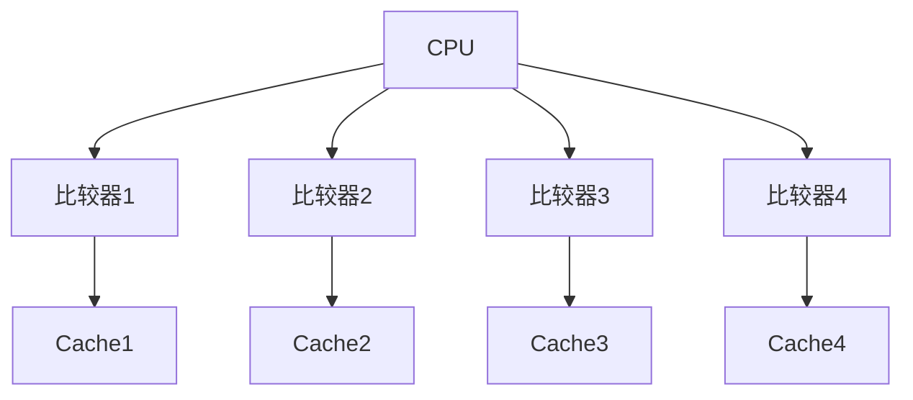
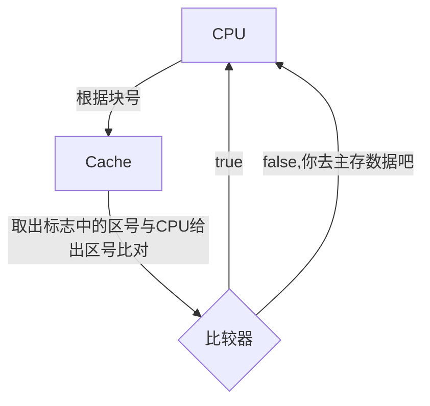
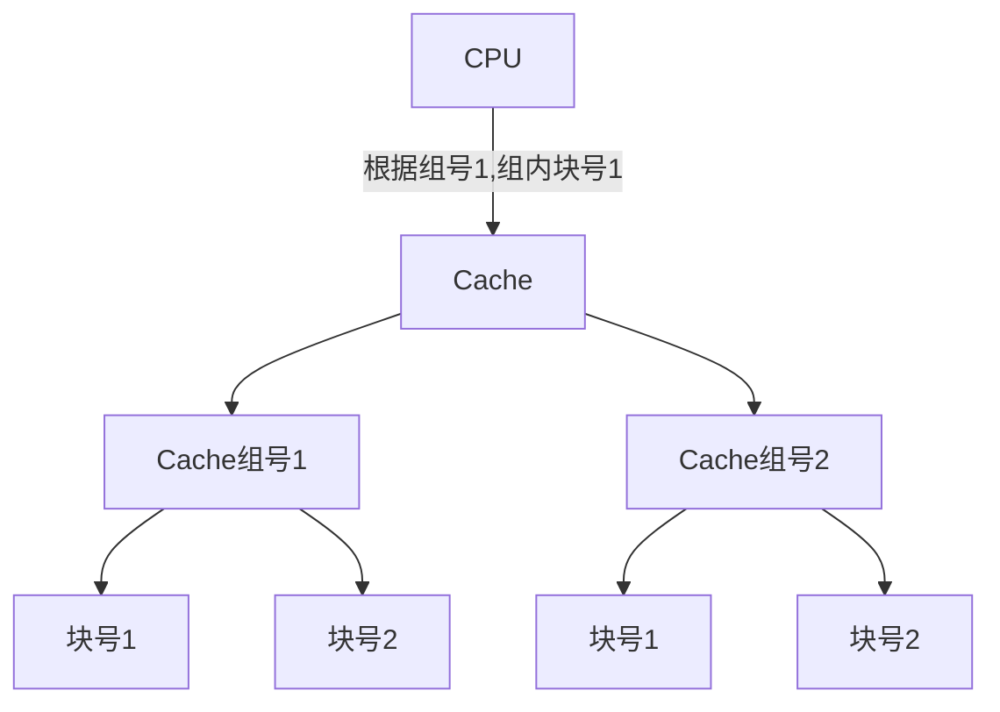

> Cache是加速CPU访问数据的一个硬件。
>
> 通过把数据预先从内存中取出来，放入Cache中存储，Cache的速度比内存快很多。CPU读取Cache的时候若是命中，速度就快
>
> 主要的四个地方：映像、替换、写入、查找

**Cache存储单元**

- 有效位字段：判断这个单元是否有效
- 标志字段：保存单元存储的数据的内存地址
- 数据字段：保存从主存中复制到单元的数据

**Cache基本运行原理**

**比较器**：比较Cache的数据标志是否时CPU传递过来的值

### 映像规则：全相联

> 内存中的数据加载进Cache时可用放置在任意Cache位。
>
> 使用全相联的情况下，Cache中有几个位置就需要多少个比较器。

可用看到下图，使用全映像情况下，一个Cache单元就需要一个比较器

### 映像规则：直接相联

> 内存中的数据分区，然后内存数据在Cache中有固定单元。
>
> 放入Cache时就直接放入那个单元，哪怕其他单元空了也不能放其他单元
>
> 使用区号给内存分区，每个区与Cache相同大小。
>
> 把内存加载进Cache时，就根据数据在内存所处位置放入对应的Cache单元中。如：在内存的第一块，在Cache中也是第一块
>
> 主存地址组成：区号、块号、数据

### 映像规则：组相联

> 内存中的数据分区，然后内存数据在Cache中有固定单元。
>
> 组的数量决定了数据在Cache中的位置可选数。
>
> 若是只有一组的情况下，和直接相联时没有太大区别
>
> 主存地址组成：区号、组号、组内块号、块内地址

**下图就可用根据组号、组内块号进行，然后取到数据后拿出区号进行对比。若是区号对的上，数据就去取对了。**

