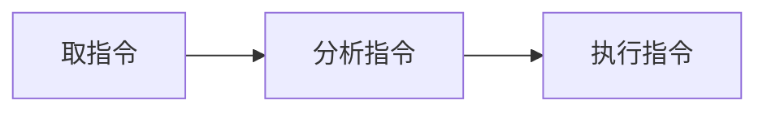
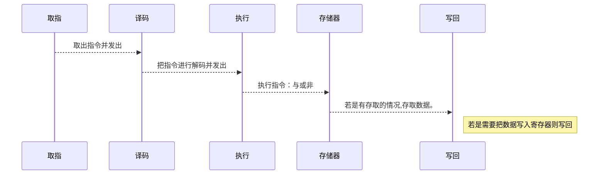

### **普通流水线方式：**

> 程序线性的运行。取指令，分析指令，执行指令，是三个部件。
>
> 有一条指令就重复一次，N条重复N次。

### **使用重叠的流水线方式：**

> 上图中三个部件，每次运行时都会浪费了一些性能。
>
> 如：执行指令时，分析指令和取指令的部件都不会运行，就空闲了
>
> 让它们不空闲，同时运行，就是重叠的方式。需要额外的硬件实现。
>
> 下图是一次重叠。二次重叠就是执行指令时也在分析指令。

下图就是分析指令的同时取第二次的指令。分析完指令后取指令的部件也把指令取完了，但是由于是一次重叠所以没有不在执行指令时重叠分析指令。

|         |           |             |             |
| :-----: | :-------: | :---------: | ----------- |
| 取指令k |           |             |             |
|         | 分析指令k |             |             |
|         | 取指令k+1 |  执行指令k  |             |
|         |           | 分析指令k+1 |             |
|         |           |             | 执行指令k+1 |

### 流水线概念

> 流水线就是把一个重复的过程拆分成不同的子过程。
>
> 每个子过程执行的时间尽可能相同。
>
> 然后每个子过程都使用不同的部件执行，使得这些部件重叠执行，

### 时空图

- **描述方法一：**横坐标为时间，某个时间程序执行的任务。纵坐标为空间，程序执行的子过程。
- **描述方法二：**横坐标为空间，某个时间程序执行的任务。纵坐标为时间，程序执行的子过程。

### 五级流水线工作时序图

> 下图中，每个时序就是一个锁存器，总共六个时序。
>
> 每个时序之间都有处理部件。
>
> 一个脉冲的时候，所有时序就会更新，如：一个脉冲就会进行一次译码，一次脉冲就会一次执行

### **流水线的分类**

**按处理级别分类**

> **指令流水线：**流水线以完成指令为目标

> **操作流水线：**流水线以完成操作为目标，如：乘法操作是指令的一环

> **宏流水线：**流水线以完成任务为目标，如：我需要发消息给B。我发出消息是流水线一环，B接收消息又是一环。

**按功能**

> **单功能流水线：**流水线只能处理一种操作，如只能加或乘

> **多功能流水线：**流水线可以处理多种操作，既能加也能乘

> **静态操作流水线：**多功能流水线子集。若指令A是处理加法，指令B是处理乘法，只能处理完A后才能开始B的操作。

> **动态操作流水线：**多功能流水线子集。如：指令A是处理加法，指令B是处理乘法，处理A同时准备处理B的数据。

**按流水线结构**

> **线性流水线：**任务是一条线执行。一级级的过去，没法跳过任何一级。也不会发生下一级返回到上一级的情况。

> **非线性流水线：**任务非线性，1绕过2直接就3。3也可以返回数据到1。

**按控制方式**

> **同步流水线：**

> **异步流水线：**

**按执行顺序**

> **顺序流水线：**按顺序执行指令，一条条指令执行。只有一条指令执行完才能执行下一条指令。

> **乱序流水线：**程序在指令时，可能会因为某些数据需要进入等待，等待时就现执行下一条指令。服务器一般都是用乱序