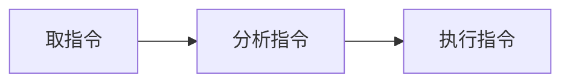
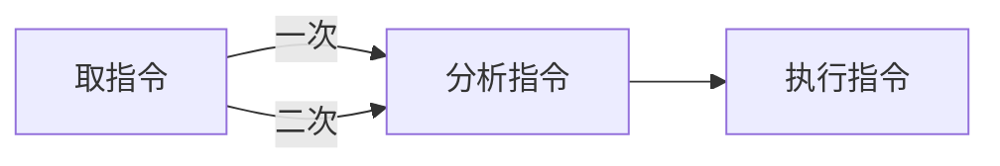

**普通流水线方式：**

> 程序线性的运行。取指令，分析指令，执行指令，是三个部件。
>
> 有一条指令就重复一次，N条重复N次。

**使用重叠的流水线方式：**

> 上图中三个部件，每次运行时都会浪费了一些性能。
>
> 如：执行指令时，分析指令和取指令的部件都不会运行，就空闲了
>
> 让它们不空闲，同时运行，就是重叠的方式。需要额外的硬件实现。
>
> 下图是一次重叠。二次重叠就是执行指令时也在分析指令。

下图就是分析指令的同时取第二次的指令。分析完指令后取指令的部件也把指令取完了，但是由于是一次重叠所以没有不在执行指令时重叠分析指令。

