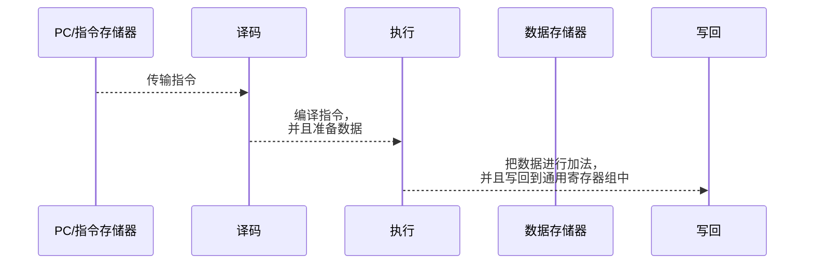
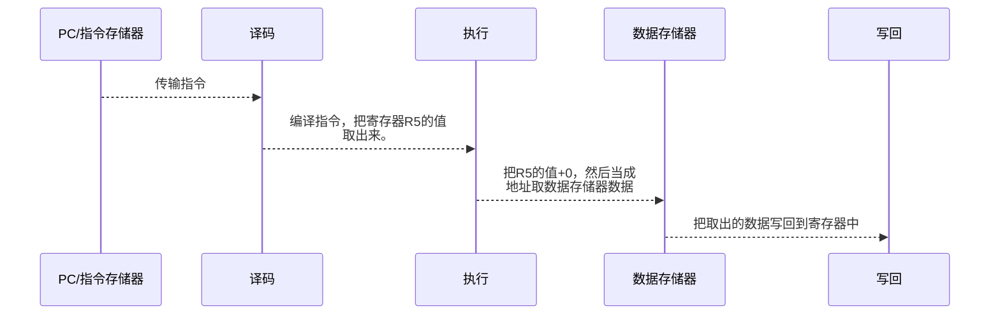

### 性能分析

**吞吐率：**每秒处理任务/指令数数。

**加速比：**使用流水线和普通的顺序执行的速度差。

**效率：**指流水线设备的利用率。

**吞吐率（Through put）**

- `k`为流水线的段数。
- `t`为时钟周期。每个周期时间。
- `n`为任务数
- `TK`时流水线执行的总时长。

$$
TK = (k+n-1) \times t
$$

> 每段时间相等情况下，吞吐率计算。

$$
TP=\frac{n}{(k+n-1) t}
$$

> 每段时间不相等情况，吞吐率计算。

$$
TP=\frac{n}{\sum^k_{i=1}ti +(n-1) \max(\Delta t1,\Delta t2, ...,\Delta tk)}
$$

> 最大吞吐率：

$$
TP = \frac{n}{\max(\Delta t1, \Delta t2,..., \Delta tk)}
$$

**加速比**

> 每段时间相等的情况下，加速比计算

$$
S=\frac{顺序执行时间}{流水线执行时间} =\frac{\Delta t \times k \times n}{(k+n-1) \Delta t}=\frac{k \times n}{k+n-1}
$$

> 每段时间不相等的情况下，加速比计算

$$
S=\frac{顺序执行时间}{流水线执行时间}=\frac{n \sum^k_{i=1}ti}{\sum^k_{i=1}ti+(n-1)\max{(\Delta t_1, \Delta t_2, \ldots ,\Delta tk)}}
$$

> 最大速度比

$$
S_{max} =\frac{\sum^k_{i=1} \Delta ti}{\max(\Delta t1,\Delta t2,...,\Delta tk)}
$$

**效率**

> 每段时间相等的情况下，效率计算

$$
S=\frac{n个任务占用时空区}{k个流水段占用时空区} =\frac{\Delta t \cdot  k \cdot  n}{k \cdot (k+n-1) \cdot \Delta t}=\frac{ n}{k+n-1}
$$

> 每段时间不相等的情况下，效率计算

$$
S=\frac{顺序执行时间}{流水线执行时间}=\frac{n \sum^k_{i=1}ti}{k \cdot [\sum^k_{i=1}ti+(n-1)\max{(\Delta t_1, \Delta t_2, \ldots ,\Delta tk)]}}
$$

> 最高效率

$$
S_{max} =\frac{\sum^k_{i=1} \Delta ti}{\max(\Delta t1,\Delta t2,...,\Delta tk)}
$$

**流水线子进程执行时间不相等解决办法：**

> 一个五级流水线，各子进程执行效率如下：
>
> 子进程1=1秒，子进程2=2秒，子进程3=1秒，子进程4=1秒，子进程5=1秒。
>
> 可以看出上方子进程的执行时间与其他子进程不同。
>
> 若是执行到子进程2时，子进程1就需要等待2执行完成，这样就陷入了性能瓶颈。

**细分瓶颈段：**把子进程2拆分成两个1秒的子进程。

**重复设置重复段：**多设置一个子进程2的执行部件，这样就可以流水线方式执行。

### 冲突/相关/Hezard

- **结构Hezard：**流水线在运行过程中，因为某个流水段周期过长导致流水线出现暂停（流水线气泡）
- **数据Hezard：**流水线的运行过程中，流水线后面程序段需要等待前段的执行结果，如：加法需要等待前数。
- **控制Hezard：** 判断语句，需要等待判断语句判断后才确定走条路径。

**加法流水线执行过程**

> ADD R1,R2,R3

**load操作流水线过程**

> LD R4,R5(0)

**解决办法**

- **插入暂停周期：**就是若是产生冲突，就把后面来的暂停掉，等前面的处理完在继续处理后面的。

- **分解组件：**设置独立的指令存储器和独立的数据存储器。独立指令Cache和独立的数据Cache。

**数据Hezard**

- **写后读：**这个是很容易出现后问题。
- **读后写：**
- **写后写：**
- **读后读：**没得问题

**定向技术Bypass**

> 解决数据Hezard问题。
>
> 这种技术就叫做Bypass技术。关键思路就是：在某条指令的产生计算结果之前，其他指令并不真正立即需要计算结果。如果能够讲该计算结果从其产生的地方直接送往需要的地方，就可以避免停顿了。
>
> 可以看出下方周期处于3的时候，第二个任务需要取C的数据。
>
> 我们从整体可以看到周期5的时候C的结果会改变，所以第二个任务取到C的值是错误的。
>
> 解决这个问题方法：
>
> 执行周期3的时候，第一个任务执行完成后，直接把结果送给第二个任务的，这样第二个任务第四周期可以拿到正确的C值来做运算了。

| 1        | 2                          | 3                      | 4                | 5                | 6          |
| -------- | -------------------------- | ---------------------- | ---------------- | ---------------- | ---------- |
| 取出指令 | 解释指令，并且取出数据A和B | 执行A+B                | 存储置空，不操作 | 把结果赋值给C    |            |
|          | 取指令                     | 解释指令，并且取出C和D | 执行C-D          | 存储置空，不操作 | 把结果写回 |
|          |                            |                        |                  |                  |            |
|          |                            |                        |                  |                  |            |

**控制Hezard**

> 控制语句在判断分支之前，提前加载指令，可能会出现加载了错误指令。这就导致控制Hezard

**解决办法**

- **提前判断：**因为之前判断是在存储阶段，把这个判断提前到译码阶段。这样就只浪费一个周期。

- **延迟槽技术：**把代码放入延迟槽中，延迟执行。
  - **从前调度：**把判断语句之前，执行了不会影响其他指令的指令放入延迟槽中，然后在判断时就执行该指令
  - **从目标处调度**：直接把判断结果为True处的指令放入延迟槽。进行译码，然后等结果看看是否蒙对。
  - **从失败处调度**：直接把判断结果为False处的指令放入延迟槽。进行译码，然后等结果看看是否蒙对。

