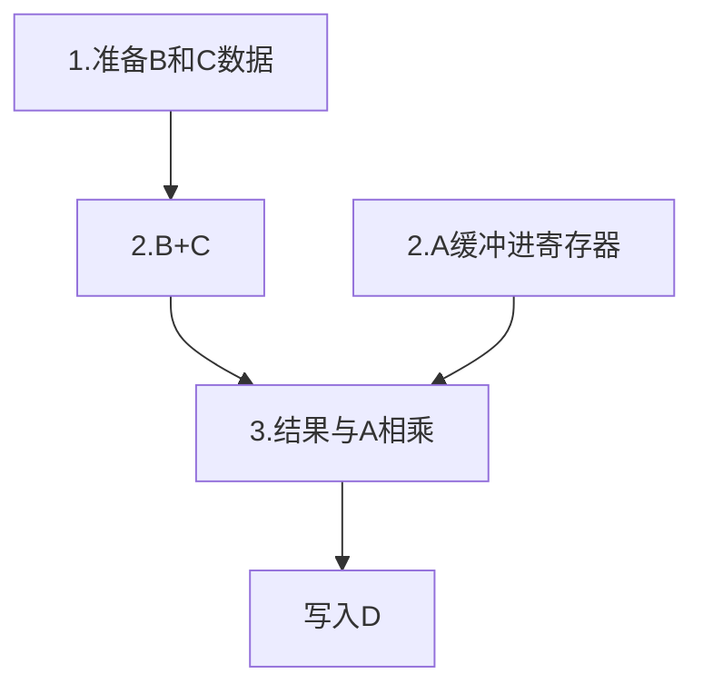

> **向量处理器由向量数据表示的处理机**

**时间重叠：**向量处理机

**资源重叠：**阵列处理机

**向量：**一个方向的量叫做向量，它通常指向一个值。这个值是可以改变的。

> 向量处理机的向量有六十四个值,每个向量的值通过下标来取数据

如：$D=A\times(B+C)$

上题中有个四个向量，每个都有六十四个值。

**纵向计算：**先把全部B+C的结果算出来->缓存结果->拿结果与A进行相乘->送给C

> 注意，它是先把$B_1$到$B_{64}$和 $C_1$到$C_{64}$全部进行相加。而不是加一次就进行一次乘法
>
> 这样做的好处是不会产生冲突，因为A$\times$(B+C)的时候，A需要等B+C算出来先。若是纵向就不用。

**横向计算：**B+C->得到结果->A+结果->放入C

> 普通的水平计算就是横向计算

**V冲突：**向量处理器在不能同时使用同一个V寄存器组。会产生冲突。

**功能冲突：**一个处理器的一个功能一次只能有一个流水线。如：乘法功能只能起一个乘法。若是之后有乘法就要等之前的乘法结束才能再起

**链接：**让一个B+C的结果出来后，立马和A进行相乘。而不是A傻傻的等全部B+C加完，在相乘

以$D=A\times(B+C)$为例子

