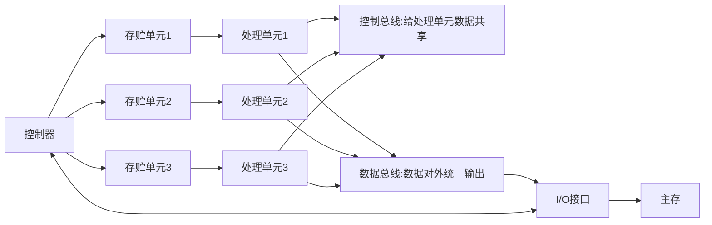
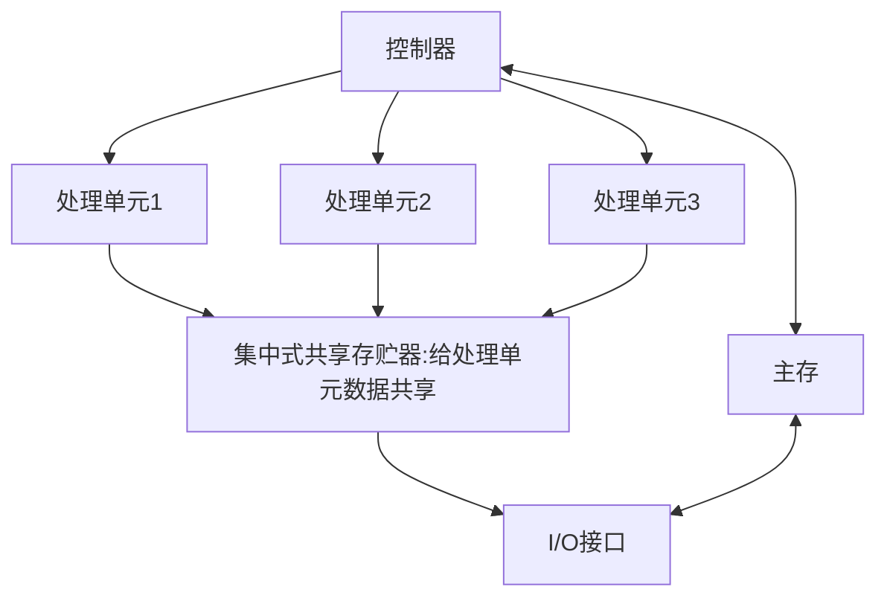

### 阵列处理机

**阵列处理机原理：**阵列处理机/SIMD

> 通过资源重复的方式提升运算速度。
>
> 单指令流多数据流。
>
> 利用并行性的同时，而不是并发
>
> 可扩展性好，通过增加处理单元来进行扩展

比如：豆子在地上，我要把豆子装进麻袋中，只有两个人的情况。

**时间重复:**一个人把麻袋口撑开，一个n人把豆子集中装进麻袋。分工不同，人越多分工越细。时间上是重复的。

**资源重复：**上面只有两个人，若是豆子多的情况下那就比较难办。那就多叫几个人。这样就是资源重复。

**分布式存贮处理器：**

> 一个分布式存贮处理器有多个处理单元，每个处理单元都有增加的存贮单元，存贮需要计算机的数据。当控制器收到一条指令,对指令进行解析然后把数据和操作发给处理单元去执行。处理单元同时执行操作只能一样，加就全部加，减就全部减。

**集中式共享存贮器并行处理：**

> 一个集中式共享存贮器并行处理器有多个处理单元，多个处理单元共用一个存贮器。

**下图是一个整列处理机**

> 整理处理机难点在于数据通信。
>
> 如处理单元0要给处理单元10传数据。蓝线步骤。
>
> 若是0和4之间没有连线的话，红线步骤。这就会导致浪费时间。
>
> 拿这样可以0和其他处理单元都连一条线吗？答案是不行的。电路太复杂了。

### SIMD的互联网络