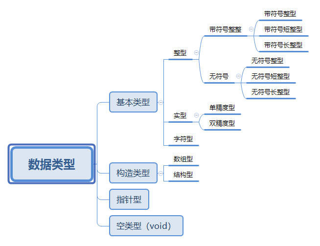

 

## **C语言基础知识**

**重点**

- C语言的字符集、关键字和标识符
- C语言的基本组成

### 本章知识点

1. C语言的发展和特点
2. C语言的字符集、关键字和标识符；
3. C程序的基本语句分类
4. C程序的基本组成
5. C程序的开发环境。

掌握C语言的基本组成，了解C语言的运行步骤的调试方法

**C语言特点**

> C语言允许直接对计算机硬件进行曹祖据哦，既具有高级语言的功能，又具有低级语言的功能，所以也被称为“中级语言”，可用来编写系统软件

1. **结构化语言**
   - C语言具有良好的结构化（顺序、选择、循环）语句。
   - C语言的函数是程序的基本模块，便于实现程序的模块化
2. **运算能力强大**：C语言提供三十多种运算符，表达式的种类多样。
3. **数据类型丰富**：包括整型、实型、字符型、数组型、结构体类型、指针、空类型等。
4. 具有预处理能力
5. 可移植性好
6. **程序执行效率高**：由C源程序生成目标代码的效率一般仅比汇编语言低10%~20%
7. **程序设计自由度大**：C语言的语法限制不严格，允许程序员具有自由度


### **字符集**

C语言的字符集是`ASCII`。主要包含下列四类：

1. 大小写英文字母A\~Z、a\~z  (52个)
2. 数字0、1、2、…、9  (10个)
3. 非字母、非数字的可现实字符（33个），既**键盘可输入的字符**，如：+ - “ ~ ( > 等。
4. 转义字符


### **关键字**

> 注意：所有的保留字均有小写字母组成，一旦有一个字母大写，其不再是保留字原来的含义、

**数据类型：**`char`、`double`、`enum`、`float`、`int`、`long`、`shnort`、`signed`、`struct`、`union`、`unsigned`、`void`

**控制语句：**`break`、`case`、`continue`、`default`、`do`、`else`、`for`、`goto`、`if`、`return`、`switch`、`while`

**存储类型：**`auto`、`extern`、`register`、`static`

**其他关键字：**`const`、`sizeof`、`typedef`、`volatile`


### **词汇分类**

- **常量：**C语言运行中其值不发生改变的量。例如-10、12.5等
- **标识符：**C程序中使用的变量名、函数名和标号等统称标识符
- **关键字：**由C语言规定的具有特定意义的字符串
- **运算符：**C语言用于计算的符号，如+  -  *  \
- **多行注释：**`/*注释*/`   **单行注释：**`//注释`
- **分隔符:**C语言的分隔符包括括号和空格两种


### 基础语句分类

- **数据定义语句：**用来定义程序中使用的各种能存放数据对象的名称和特性 - `int a,b,c;`

- **赋值语句：**形如`变量 = 表达式` 的语句，功能市计算表达式的值并赋予变量 -  `a = 2 ; b =3;`

- **函数调用语句：**形如`函数名(实际参数表)`的语句，功能市调用指定函数 -`a = avg*(x,y,z);`

- **表达式语句：**仅由任何表达式组成的语句 - `c = a+b;`

- **流程控制语句：**用来控制程序执行过程的语句

  - **选择控制语句：**`if() ~ else ~`   `switch`
  - **循环控制语句：**`for() ~`  `while() ~`   `do ~ while()`
  - **中止语句:** `break`
  - **继续循环语句：**`continue`
  - **返回语句:** return 
  - **无条件转移语句：** goto

- **复合语句：**用花括号括住的一组任一语句    （埋：复合语句的作用？）（填：判断后需要执行需要多条语句一起执行时，可以使用复合语句）

  - 
    
    ```c
    main(){
        .....
        {......} // 复合语句。 注意：右括号后不需要加;
        ....
    }
    
    
    ```

- **空语句：**无任何操作的语句，既只由分号组成的语句，一般在程序中用作空循环体。

  - ```c
    while(getchar() != '\n')
        ;
    /*
    这里的循环体为空语句，表示循环体什么都不做
    注意：while(getchar() != '\n');和上面程序段功能一样
    */
    ```

- **其他语句：**包含编译预处理命令、用户自定义类型语句等 - `#include "stdio.h"`


**普通的C语言例题**

- 从键盘输入两个整数，计算其乘积 （主函数实现）

```c
 #include <stdio.h> /*编译预处理命令*/
int main(void){   /*主函数*/
	int n1, n2, result; /*定义保存两个整数及其乘积的变量*/
	printf("please input the two numbers:\n"); //屏幕显示提示信息
	scanf("%d,%d", &n1, &n2); //从键盘输入两个整数并分别保存在变量n1和n2
	result = n1*n2;
	printf("the result is:%d\n", result); //输出变量result中的两个整数的乘积
	return 0; //返回
		
}
/*
please input the two numbers:
2,3
the result is:6
*/
```


- 从键盘输入两个整数，计算其乘积（多函数实现）

```c
#include <stdio.h>
int mul(n1, n2){
    return n1 * n2;
}

void main(void){   /*主函数*/
	int n1, n2, result; /*定义保存两个整数及其乘积的变量*/
	printf("please input the two numbers:\n"); //屏幕显示提示信息
	scanf("%d,%d", &n1, &n2); //从键盘输入两个整数并分别保存在变量n1和n2
	result = mul(n1, n2);
	printf("the result is:%d\n", result); //输出变量result中的两个整数的乘积
}


/*
please input the two numbers:
3,5
the result is:15
*/
```


### C程序的基本组成特点

- 函数是C程序的基本单位。每个C程序是由一个或多个函数构成。每个C程序有且仅有一个主函数，该主函数的函数名规定为main。

- 每个函数（包含主函数）的定义分为两个部分：函数首部和函数体。

  - ```c
    函数首部： 返回值的类型 函数名(类型 形式参数名, ...)
    函数体：   {
    	数据定义部分
        实现函数功能的语句串
    } 
    注意：当函数没有返回值时写void
    ```

- C程序中每个语句以“分号”作为语句的结束，“分号”是C语言的组成部分，不可以省略。但预处理命令和函数首部之后不能加分号。

  - ```C
    #include <stdio.h>  //编译预处理命令
    int main(void)   //函数首部不是一条完整的语句
    ```

- C语言本身没有输入/输出语句，而是通过调用库函数`scanf()`、`printf()`、`getchar()`、`putchar()`实现的

- C语言的任任意位置都可以加注释，注释不编译。单行注释`\\注释`  多行注释`\*注释*\`

- 程序的书写格式灵活，一行客书写多条语句，一条语句可以写在多行上，可以任意插入空格和回车。但为了程序清单层次分明、便于阅读，通常都采用缩进并对其的书写方法。一条说明一条语句占一行。使用空格或TAB缩进{}对齐。有足够的注释。有合适的空行

- C语言中主函数和其他函数的位置是任意的，但程序执行总时从主函数开始，并在主函数结束。其他函数总是通过函数调用语句被执行

- 主函数可以调用其他函数；任何其他函数都可以相互调用，但不能调用主函数。

- C程序中可以有预处理命令（例如`include`命令），通常预处理命令应放在程序的最前面。

- C语言编译系统区分字母大小写。

   

### C语言的运行步骤


### C程序的调试

程序的错误分：语法错误和逻辑错误。

**语法错误**能够在编译过程中被发现并修改；

**逻辑错误**的程序往往可以顺利编译甚至执行，但执行的结果不同于预期。由于较难准确定位逻辑错误，所以程序开发环境一般都会提供程序调试工具来观察程序中各变量、寄存器等值的变化，以便发现程序中的逻辑错误。 

**调试手段：**设置断点、重启调试、停止调试、逐语句调试、逐过程调试


## 数据类型、运算符和表达式

**重点**

1. 基本数据类型常量和字符串常量的书写方法
2. 变量的定义、赋值、初始化以及使用方法
3. 基本运算符的运算规则、优先级和结合性
4. 表达式的构成规则和计算

难点

- 运算符的优先级
- 混合表达式的计算


### C语言的数据类型及其关系图

<a href='https://github.com/sorryle/sorryle.github.io/blob/main/assets/files/file/data_type.xmind'>数据类型逻辑图文件下载</a>




**C语言数据类型的说命**

1. C语言规定在使用一个数据之前，必须定义数据的类型，因为数据类型决定了数据占用内存的字节数、取值范围以及在其桑可以进行的操作等。	
   - 如：`int a = 2; // 系统会分配两个字节给变量，直到主动释放或者程序结束 - 定义好了数据类型，程序就可以知道这个变量可以使用什么方法 `
2. C语言的数据有常量和变量之分，它们分别属于上述的类型。
3. 数据类型丰富，包括整型、实行型、字符型、数组型、结构体类型、指针型和空类型等。


### **常量的基本概念**

- 常量又称为常数，是程序运行过程中其值不能改变的数据。
- C语言规定常量包括：整型常量(1)、实型常量(1.2)、字符型常量(‘t’)、字符串常量(“test”)、符号常量（埋坑：什么是符号常量）
- 使用常量时，不需要事先定义，只需要在程序中直接写出。常量的类型客通过书写形式自动识别，无需定义。


**整型常量**

- **十进制整数：**由数字0-9和正负号表示。如：`0、-111、+15、21`等
- **八进制数（以0开头）：**例如：`00、-0111、+015、021`（埋：二进制转八进制）（填：三合一法，`101110.101 = 56.5`）
- **十六进制整数（以0x开头）：**例如：`0x0、-0x111、+0xff、0x2d`

说明：

- 正整数前面的`“+”`可以省略。
- 整型常量在16位计算机中占用2个字节，数值范围位$-2^{15} ~ (2^{15}-1) = -32768~32767$
- 长整型常量(在整型的末尾加个字符`L`):
  - **例如：**`0L(十进制)`、`0111L（八进制）`、`0x15L(十六进制)`长整型常量在计算机中占用4个字节。其取值范围可达$-2^{31} ~ (2^{31} -1)$(埋坑：计算机出具体数值)
  - <font color='red'>注意：10和10L是不同的整型常量，虽然它们由相同的数值，但它们在内存中占用不同数量的字节。</font>（埋坑：为什么要这样设计，常量不会变量，为什么要占用那么多字节）（填坑：长整型的出现是为了存放计算结果，如：$10^{10}=100亿$​​​，使用i整型常量是不能装不下的，这时候可以放到长整型中）
  - 

