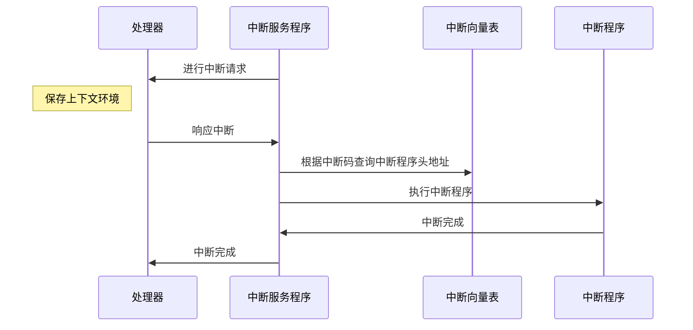
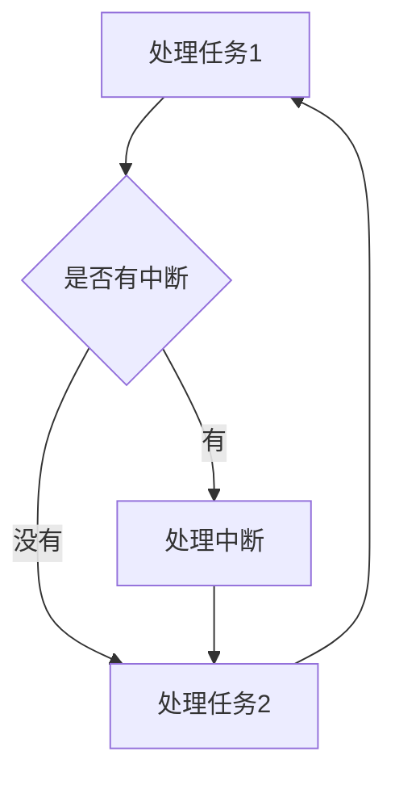

## 引言

1. 系统结构 主要研究：`降低功耗`、`降低成本`、`增加性能`
2. 处于软硬件之间，进行连接作用
3. 比较接近本质，学会了本质，在应用层就好混多了


## 第一章：概述

**本章要点：**

1. 层次性、系统结构等概述
2. 软硬件取舍
3. 定量分析原理
4. 并行性概念


**实际内容：**

- **计算机系统的层次结构**

  - 计算机系统是由硬件 + 固件 +  软件
    - 固件：软件到固化硬件上，较难更改的，如:BIOS
  - 透明性：高层可以不必关注底层，底层对高层是透明的、看不见的
    - 如果要专业还是要关注底层
  - 层次
    - **浅蓝色的是硬件层，无色的是软件层**
    - 应用语言：如国语，你对人工智能说一句国语指令，他会给你相对应的操作
    - 高级语言：如：Java、C ，把应用语言变成实际的动作
    - 汇编语言：如：早期的语言，C语言是先转换成汇编在转换成机器语言
    - 计算机虚拟机：如：Windows，实现硬件交互提供一些硬件API给汇编、高级语言使用
    - <font color='cornflowerblue'>机器语言：纯粹的0和1，如：你是32位操作系统，那一个指令序列就是32个0和1</font>
    - <font color='cornflowerblue'>微程序语言：如：32位操作系统，一个指令序列又被分为3到5个微程序语言给硬件操作</font>
  - 语言的特性
    - 翻译/编译性：如：C语言，直接写完，直接全部翻译成机器语言
    - 解释性：如：Python，执行一条，让Python解释器解释一条，语句是一条一条执行的。所以IDE才可以注入代码

- 计算机系统结构

  - 系统结构是为判断一个功能，用软件实现比较好，还是硬件
  - 相同的系统结构，可以有不同的组成，一种组成又有不同的实现
  - 系统结构：如：我需要一台绘图的电脑，绘图的软件、选择几核的CPU、什么显卡
  - 计算机组成：如：我要2核的CPU，又有各种型号的CPU
  - 计算机实现：实际制作的技术，如：我使用32纳米能做，使用28纳米也能做，只是性能等不一样

- 计算机系统的软硬件取舍

  - 设计系统结构的时候应该把价格比考虑进去，以合适的价格设计出功能

  - 硬件的性能往往要比软件高

  - 设计系统的时候要考虑，硬件，软件

    - 如：服务器的CPU和家用的CPU
    - 如：画图工具和PS

  - 成本计算公式

    - 成本计算中要计算性能、综合指标

    - Dh是硬件研制成本， Ds是软件的研发成本

    - Mh是硬件生产成本，Ms软件生产成本

      - 软件的生产成本是维护、实施等

    - C是软件需再次设计的次数，R是软件重新生产的次数

    - 假定生产V台：

      - 硬件的成本：
        $$
        Dh / V + Mh
        $$

- 软件的成本：
      $$
      C * Ds / V + R * Ms
      $$
      

  - 只有当硬件成本小于软件成本时，用硬件才适合

- 计算机系统的性能，定量分析

  - <font color='red'>系统思维：看全局，不要单看一处</font>

  - 性能指标

    - **蓝色字体可以参考，但不一定准确**

    - 响应时间：如：你请求一个网页，从发出请求，到浏览器渲染完成的时间,你自然希望越快越好

    - 吞吐量：如：100万人访问一个网页，我只要这个网页能在1.5秒内响应完成就行了。

    - <font color='cornflowerblue'>处理机主频：主频、外频、倍频</font>

    - <font color='cornflowerblue'>MIPS：每秒百万条指令。</font>

      - $$
        MIPS = 指令条数 / 执行时间 * 10的六次方
        $$

        

    - <font color='cornflowerblue'>Mflops：每秒百万浮点指令</font>

    - 真实程序的运行时间

      - 有特定的机构会发布特定的测试程序，让两个机器来运行该程序，得出的时间短的就好

  - 大概率事件优先原则（哈夫曼压缩原理）

    - 加快经常性事件的速度

  - 阿姆达尔（Amdehl）定律

    - 定义系统性能的加速比，确定性能，计算改进某些部件所获得的性能提升
- 如：我扫描功能比较慢，那我改进扫描的硬件，提高性能
  
    - 加速比公式：

$$
改进前总执行时间 = 不可改进部分的执行时间 + 可改进部分改进后的执行时间
$$

$$
改进后总执行时间 = (1 - 可改进比例) * 总执行时间改进前 + 可改进比例 *改进前总执行时间 / 
部件加速比 = [(1-可改进比例) + 可改进比例/部件加速比] * 改进前总执行时间
$$

$$
加速比 = 改进后系统性能 / 改进前系统性能=改进前总执行时间/改进后总执行时间 = 1/ (1-可改进比例) + 可改进比例/部件加速比
$$


- 例子：

- 将计算机系统中某一功能的处理速度提高到原来的**20倍**，该功能的处理时间仅占整个系统运行时间的**40%**，则采用提高性能的方法后，能使整个系统的性能提高多少？

  - 解：
    - 可改进比例是40% = 0.4
    - 部件加速比是 20
    - 总加速比 ：
      - 1 /（1-0.4) + 0.4/20
    - 1 / 0.62
    - 约等于：1.619
    - 性能大越提高了62%

  
  
- 程序局部性

  - 时间局部性：如：我写了个for循环，这个时间内我会一直在该时间内执行这个代码
  - 空间局部性：如：我访问了第一条语句，那接下来就有可能访问第二三四五条语句

- 软件、应用、器件的发展对系统结构的影响

  - 软件的可移植性：同一套可以在各个平台运行，如：Windwos平台、Linux平台、Android平台
  - 兼容性：
    - **蓝字是比较重要的**
    - 若是要解决兼容性的问题就加东西，不能删东西，不能我这个版本这个指令可以用，下个版本就指令了
    - 向前兼容：与向后兼容相反
    - <font color='cornflowerblue'>向后兼容：软件要兼容以后发布的版本，如：我现在用到处理器是Inter五代，我换成六七代时也可以用</font>
    - 向下兼容：与向下兼容相反
    - <font color='cornflowerblue'>向上兼容：要兼容更好的硬件，如：我现在用的是Inter五代-I3，我换成I9也可以使用</font>
  - 应用：
    - 宿主机：实际存在的计算机
    - 模拟：在宿主机上创建个虚拟机，把虚拟机的指令翻译成宿主机的指令传给宿主机。如：Vmware
    - 仿真：用宿主机的的微程序去解释虚拟机的指令集，要求：系统结构相差没有那么大
    - 仿真比模拟的速度快
  - 器件:
    - 对计算机的需求驱使着计算机的发展
    - 摩尔定律：CPU每18月性能会翻一倍。注：现在没有那么夸张了
    - Memory：内存（Memory）每两年，容量翻2倍
    - Disk：硬盘（DIsk）每一年会容量翻一倍
  - <font color='orange'>**器件的发展在早期时对性能有很大的提升，近年来提升没有以前那么明显了。现在提升性能主要时系统结构**</font>

- 并行性概念

  - 并行性是指一个时间内同时运行
    - 同时性：处理器同一时间处理多个进程请求
    - 并发性：处理交替处理多个进程请求
  - 并发性级分类
    - 微程序级并发：从微指令层次进行并发处理
    - 指令级并发：从指令层次进行并发处理
    - 线程级并发：一个程序多线程的并发处理任务，通常是程序员优化程序性能的方法
    - 进程级并发：操作系统同时处理多个进程的请求
    - 程序级并发：集群同时处理请求
  - 程序分解
    - 指令流：程序要实现的操作，实现如何操作
    - 数据流：程序实现操作时使用的数据
  - 各种模式流
    - 蓝色字体为常用的
    - <font color='cornflowerblue'>SISD：单指令处理单数据</font>
    - <font color='cornflowerblue'>SIMD：单指令处理多数据</font>
      - 如：处理图片
    - <font color='cornflowerblue'>MIMD：多指令处理多数据</font>
    - MISD：多指令处理单数据
      - 只存于理论，没有CPU是这样实现的


## 第二章：数据表示、寻址、指令系统

数据表示是硬件对数据类型的支持，

如：我的程序经常处理字符串，若是硬件不支持这种数据表示，我就要使用软件来实现，使用数组存储字符


**重点**

1. 浮点数、尾数、溢出、自定义数据表示
2. 整数边界存储，再定位
3. 操作码优化、指令字格式优化
4. RISC思想及技术


- 各种数据表示

  - 定点数据表示：加减乘除
  - 浮点数数据表示：小数
  - 逻辑数据表示：与或非

- 变址操作对、阵列数据结构的支持

  - 我要对一百个向量里的值都进行加1，我就要输出一百条指令
  - 若是我支持变址操作，我就取到向量基址，放入变址寄存器存储，然后每次对变址进行+1，得到有效地址，然后根据有效地址对数据进行操作

- 硬件引入数据表示的原则

  - 能减少数据的体积
  - 能减少从内存读取的数据，处理器处理数据挺快的，主要是读取数据比较慢
  - 其通用性和利用率是否提高

- 操作数的大小

  - 字节（8位），半字（16位），单字（32位），双字（64位）
  - 浮点数的单精度就是单字，双精度就是双字

- 高级数据表示

  - 数据标志符：每个数据前面都包含了一个数据标志符，描标志自己是什么类型的

    - 作用:
    - 假设我计算机中只有对整型进行相加的指令，若是我要对浮点数相加就要新增一条指令，若是要对更多数据类型支持，就要新增更多指令
    - 使用数据标志符后，我计算机只有一条加法指令，每次相加前去读取数据标志符，这样就知道用啥相加了
    - 减少指令条数，

  - 数据描述符

    - 可以对单条或多条数据指向数据描述符描述指定类型

    - 数据都有一个块内存，存放着信息：数据描述符，数据标识符，数据长度，数据地址

      - 描述符：描述自己是数据还是数据描述符
      - 数据标志符：数据类型
      - 数据地址：若是数据长度为三，则指向三个地址

    - 我通过数据描述符找到数据描述符存储地址，可以得到该组数据的类型

    - 如：

    - ```python
      [[1, 2, 3], [4, 5, 6], [7, 8, 9]]
      ```

    - 我最外面的list就指向一个数据描述符，数据标志符，长度为3，地址指向三个描述符地址，

    - 另外三个描述符：长度为3，地址指向三个数据

  - 向量数据：比如：概念类似于变量，向量就是指向变量的内存地址

  - 堆栈数据：有效的支持子程序的嵌套和递归，堆是先进后出的。

    - 如：我A调B，B调C，入栈就是A先进去，然后B进去，C进去，出去就反过来，C先出去

  - 浮点数：小数部分使用不同进制表示，会影响结果。

    - 进制大的情况下：运算速度快、精度损失小
    - 截断法：小数加减过程中下溢的时候，直接把下溢部分截断
    - 舍入法：对下溢部分四舍五入
    - 恒置”1“法：
    - 查表舍入法：

- 寻址

  - 面向寄存器、面向堆栈、面向主存。面向啥就从哪里取操作数，少部分从寄存器或主存取

  - 寻址：寻找指令在计算机中的所处位置，有些时候使用计算机中有逻辑地址

  - 寻址方式在指令中的指明：

    - 指令格式：操作码+地址码 
    - 通过占用操作码的某些位来指明。如：我把操作码定义城直接取值，就不用去找地址了，直接从指令中取值，相当于立即数寻址
    - 在地址码部分专门设置字段指明。

  - 寻址方式：

    - 变址寻址：给定变址寄存器+指令地址码  ，运用在数组中

    - 相对寻址：下面代码中if是基地址，如果判断为False，就加入if下面的代码块长度，得出else代码块的地址

      ```Python
      if 1:
      	pass
      else:
      	pass
      ```

      

    - 基址寻址：基地址寄存器+指令的地址码，运用在虚拟机技术上

    - 堆栈寻址：进栈+1，出栈-1。

    - 立即值寻址：直接取值，不用去寻址

    - 直接寻址：通过地址值直接找数据

    - 寄存器直接寻址：直接取出寄存器的值

    - 寄存器间接寻址：把寄存器的值作为地址，拿去寻找地址

    - 存储器间接寻址：取出存储器的值，然后把值当地址去寻找地址

  - 主存物理地址：实际存在的内存空间
  - 逻辑地址：程序设计时的地址空间，从1开始，之后通过寻址方法变成逻辑地址
  - 寻址方式：
    - 静态在定位：程序载入内存时，直接把程序的逻辑地址转换成物理地址
    - 动态在定位：运行程序时，给程序分配一块连续的空间，当需要访问的时候就直接：基址+指令逻辑地址码
    - 虚实映射表：程序的逻辑地址和对应的物理地址映射的到一块表里，通过查表的方式寻址，可以一个物理地址对应多个逻辑地址，多个逻辑地址交替把数据放进去就行了。这种方式可以逻辑地址比实际内存空间大
  - 宽度信息存储：主存宽度8字节，存储元素时会判断这个内存块是否可完整的存储，若是不能完整放入，就放入下一个内存块
  - 物理主存中信息的存储分布
    - 学习地址：https://zhidao.baidu.com/question/1831312260866385740.html
    - 因为半字需要两个Byte进行存储，记录的地址就是数据开始的地址，所以每次存储数据时，低一位必然为0
    - 字节信息地址：
    - 半字信息地址：低一位必然为0 如：xxxxxx0
    - 单字信息地址：低两位必然为0 如：xxxxx00
    - 双字信息地址：低四位必然为0

- 指令系统

  - 指令的基本格式：操作码 + 操作数地址

    - 操作数地址可以没有，因为有些时候不需要数据

  - 指令编码

    - 定长:指令的操作码是固定长度的，长度越大指令越多。如：教学的系统
    - 变长：指令的操作码可以改变，可扩展性高。如：商用的系统

  - 指令类型：

    - 逻辑运算和算数运算（ALV）：与或非异或加减乘除
    - 输入输出：计算机的各种输入输出设备
    - 堆栈：先进先出的实现
    - 空操作：不进行任何操作
    - 中断开启：停止当前任务，进入请求中断的任务
    - 中断关闭：关闭请求中断的任务
    - 转移指令：跳转，if else。我可以让程序顺序颠倒运行

  - 指令的需求：

    - 软件设计需求：
      - 正交性：操作码、地址等编码格式互不影响。不出现改了你，影响我的情况
      - 规整性：统一长度，分析简单
      - 对称性：规定的格式，有规律模式，如：1+1 ，1-1 这样的对称的指令，不要搞成add (1，1)，1-1
      - 独立性和全能性：一条加法指令，不要去实现减法功能，也不要有多条加法指令，我就一个加法可以加所有的数据
      - 可组合性：指令之间可以互相组合
      - 可扩充性：可以扩充指令
    - 系统结构需求：
      - 可扩展：可以较容易增加指令，不会增加一条指令导致整个系统不能使用
      - 兼容性：向后兼容，不能更新后，以前就不能用了
      - 指令密度适中：功能不需要复杂，也不需要太差

  - 指令优化

    - 优化指令操作码

      - 定长指令操作码：固定的码数会可能导致空间极大浪费，并且降低运行速度
- 变长指令操作码：常用指令的操作码设置为较短，寻找时提高了运行速度。并且占用空间也会减少
      - 哈夫曼编码：

        - 通过构建哈夫曼树来进行优化指令，使用变长的操作码
- 当各种事件发生改了不均等时，根据使用频率来判断哪些该编操作码为短，哪些编操作码为长。提高运行效率
        - 构建哈夫曼树：把所有节点放入队列中，把使用频率最低的两个节点合并成新节点，新节点就成了两个频率最低节点的父节点。如此反复，直至只有根节点。
- 下方公式是计算信息源熵（信息源所包含的平均信息量）
  
$$
  H=-\sum p_i \ \ log_2p_i
\\ P_i是频率
$$

  

  - 例题：一台模型机共有七种不同指令，使用频率如表，求平均使用时长
  
- | 指令  | 使用频率 |
    | ----- | -------- |
  | 指令1 | 0.4      |
  | 指令2 | 0.3      |
  | 指令3 | 0.15     |
  | 指令4 | 0.05     |
  | 指令5 | 0.04     |
  | 指令6 | 0.03     |
  | 指令7 | 0.03     |

$$
H = 0.4 *log_2(0.4) + 0.5*log_2(0.3)+0.15*log_2(0.15)... \\ = 0.4 *1.32 +0.3*1.74+0.15*2.74.... \\ =2.17
$$

要表示这七条指令的操作码，操作码平均只需要2.17位bit就可以采用3位定长操作码表示的信息冗余量：
$$
\frac{操作码的实际平均长度 - H}{操作码的实际平均长度} = \frac{3-2.17}{3} = 0.28(28\%)
$$
只要采用哈夫曼编码，平均码长计算公式：

- li = 指令操作码比特位
-  Pi = 指令使用频率 

$$
\sum\limits_{i = 1}^7 Pi \cdot li=0.4*1+0.3*2+0.15*3+0.05*5...=2.20（位）
$$

非常接近与可能的最短位数(H)2.17位，信息冗余量1.36%

哈夫曼编码可以极致的压缩编码位数，但是长短不一，所以固定几个定长编码，便与编写

- 操作码扩展

  - 15/15/15编码法
  - 设：指令字长位16位
    - 0000 ~ 1110，设置为三类地址指令，留下1111进行扩展
  - 1111,0000 ~  1111,1110，设置为二类地址指令，留下1111,1111进行扩展
    - 1111,1111,0000 ~ 1111,1111,1110 ，设置为一类指令，留下1111,1111,1111扩展
    - 零类指令，根据上头类推
  - 8/64/512编码法
    - 设指令字长16位
    - 0000 ~ 0111 ，设置为三类指令，留下1000 ~ 1111扩展
    - 1000,0000 ~ 1111,01111,设置为二类指令，留下1111,1000 ~ 1111,1111进行扩展
    - 依次类推可得出512个操作码
  - 例题：
    - 三地址指令4条，单地址指令255条，零地址指令16条，设指令字长为12位，每个地址码3位，能否以扩展操作码为其编码？
    - 若单地址指令位254条呢？
    - 解：
      - 三地址指令：000 ~ 0111 ，留下100 ~ 111扩展
      - 单指令：100.000 ~ 111.110 , 留下111.111扩展
      - 零地址指令：111.111.000 ~ 111.111.111 不满足16条，只有八条
      - 单地址改为254就可以

- 指令字格式优化

  - 指令密度高一些：
    - 功能性好一些。如：加法指令，我单地址的话要用三条指令，两个取加数，一个存结果，三地址的话就直接加然后存结果就行了
  - 指令的寻址优化：
    - 使用基址的方式寻址，加上偏移量
  - 指令的存储：
    - 存储时要用整型
    - 指令要用变长的，用定长会导致浪费,如：固定长度，操作码+ 空 +操作地址
    - 指令在存储在主存时，不要拐弯,应直接存储在一个块内
    - 拐弯：主存16位宽度块中放置的指令长度为14位的指令，下一条指令时3位的，就把下一条指令的前两位放到当前块，把后一位放到下一个块中，这样取出指令时要访问主存两次，耗费性能

- CISC

  - 复杂的指令系统，要兼容以前的指令，只能加指令不能删指令
  - 面向目标程序的优化：
    - 把高级的指令去兼容以前低级的指令，去除低级指令
    - 优化指令的存储空间
    - 优化常用指令运行速度
  - 面向高级语言的优化：
    - 高级语言直接解释为指令
    - 高级语言与微程序之间有个虚拟机，由虚拟机来解释
    - 高级语言的一些语法指令化
    - 缩短编译程序长度和编译时间
  - 面向操作系统的优化：
    - 对操作系统的子程序，进行一个固件化、硬件化
      - 固件化：把子程序以微程序的方式固化
      - 把子程序以硬件方式实现
    - 增设操作系统的专用指令

- RISC

  - 只支持使用频度高的指令
  - 指令支持操作寄存器的数据，若是数据在主存统一取到寄存器中，对主存指令只有存和取
  - 增加更多的寄存器，增加更多的cache（高速缓冲区），数据cache、指令cache
  - 重叠寄存器窗口
    - 可支持多个程序，每个程序都有全局区、本地区、高区、低区，每个程序都是一个窗口
    - 全局区：全局变量，所有寄存器都可以共享的区域
    - 本地区：自身独享的数据
    - 高\低区：A程序调用B程序，A调用B时传入一些数据就放到B的高区，B的高区同时也是A的低区
  - 优势：
    - 减少访问主存的速度，访问主存消耗时间较多
    - 指令运行速度较快
  - 缺点：
    - 因指令数的减少，编译器设计难度提高
    - 复杂的功能需要使用多条一样的指令导致存储空间增加
  - 指令顺序举例：
    - 设A, A+1,B,B+1 四个单元，要把A和A+1的内容存储到B和B+1中。
    - 寄存器只有一个的情况：
      - 取出A到寄存器C，然后把寄存器C的值存入A+1，取出B到寄存器C，然后把寄存器C的值存入B+1中
      - 执行流水不流畅，浪费时间
    - 若是有多个寄存器，并且编译程序聪明就可以
      - 取出A到寄存器C，取出B到寄存器D，然后把寄存器C的值存入A+1，然后把寄存器D的值存入B+1中
      - 执行流水流畅


##   第三章 ：存储、中断、总线与 I/O

内容较碎，不是一个系统的内容


### 存储

曾经购买电脑是追求的是运算性能，运算能力越高，越好，但是摩尔定律被打破后，现在的选购电脑，追求存储。

存储有三个要点：

- 容量大：存储的空间
- 速度快：读写速度
- 便宜：价格

市面上暂时没有具备三个要点的存储设备，举个例子：

我要容量大，那我购买硬盘，但是硬盘读写速度相对来讲较慢

我要速度快，我就购买内存条，但是同等的内存条空间相对硬盘空间来讲贵了几十上百倍。


#### 单体单字：

存储器里里面有个容器叫`体`，每个`体`都储存<font color='red'>单个字</font>的数据，

过程时序图：

```sequence
处理器->地址寄存器: 放入一个地址
存储器-> 地址寄存器:取出地址
Note right of 存储器:根据地址搜索数据
Note right of 存储器:搜索到一个字数据
存储器 -> 读出寄存器:把一个字数据放入读出寄存器
处理器->读出寄存器:把数据读出来
```


#### 单体多字：

存储器里里面有个容器叫`体`，每个`体`都储存<font color='red'>多个字</font>的数据。

与单体单子的区别就是，每次取数据都是多个字，然后CPU选择哪个字才是自己要的数据


#### 并行存储系统：

每个序列分布式交叉存储在不同的体中，然后CPU读取数据时，分别向不同的`体`发送读取数据的请求，每个`体`读取数据都是需要一点时间的，秉着我不能让`处理器`闲着的策略，处理器就不等`体`读取完数据，直接叫下一个体去读数据，直到叫完所有`体`，才去读出寄存器收数据。

交叉存放：

```sequence

序列12345->abc体:交叉存放在abc体中
序列12345->a体:序列中的1,4两个值
序列12345->b体:序列中的2,5两个值
序列12345->c体:序列中的3一个值

```


### 中断系统

中断是一个系统中极其重要的功能。

#### 中断过程




中断向量表

中断向量表以键值对存储： 中断向量=中断程序头地址


#### 中断的基本概念

**中断函数是void类型的，既不入参，也不出参。**

| 词         | 意                                                           |
| ---------- | ------------------------------------------------------------ |
| 中断源     | 什么发出中断请求                                             |
| 中断程序   | 处理中断请求的程序，如我一个键盘中断，就有一个专门处理键盘中断的程序在内存中 |
| 中断使能   | 中断不是一开始就可以中断，要用中断使能让其运行               |
| 中断屏蔽   | 屏蔽掉一种中断请求，如我屏蔽键盘的中断请求                   |
| 中断优先级 | 中断可以分优先级，比如：硬件故障中断的优先级应该比键盘中断高？？ |
| 中断嵌套   | 有了中断优先级就有会出现，我这边一个键盘中断正在处理，突然来个电脑硬件坏了，那肯定要先处理硬件问题，这时候就保存键盘中断的上下文环境。转去处理硬件问题 |
| 中断请求   | 请求处理器进行中断                                           |
| 中断响应   | 处理器响应中断                                               |


#### 轮询处理方式

不用中断程序，也可以达到处理突发事件的效果，那就是使用**轮询**的方式，但是一般没人这么干，因为缺点很大。

**缺点：**

- 响应速度慢，可能我刚判断完成，中断就来了，那就得在等一轮
- 浪费资源，不管是否有中断，每次都要进行判断，这样就浪费了资源





