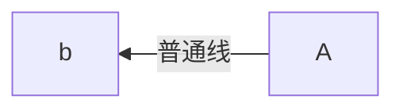

## 博客的改造

## Github Page被百度收录

这里有一篇十分详细的教程，所以就不重复造轮子了。

[贾小坤](https://zhuanlan.zhihu.com/p/111773896) - Github Pages部署到静态站的教程


## Liquid的基础语法



[Liquid学习网址](https://liquid.bootcss.com/basics/introduction/)

[Jekyll—Liquid网站学习](https://jekyllrb.com/docs/liquid/)

### 逻辑操作符号

|    符号    | 意                                                           |
| :--------: | ------------------------------------------------------------ |
|    `==`    | 相等                                                         |
|    `!=`    | 不相等                                                       |
|    `>`     | 大于                                                         |
|    `<`     | 小于                                                         |
|    `>=`    | 大于或等于                                                   |
|    `<=`    | 小于或等于                                                   |
|    `or`    | 逻辑或                                                       |
|   `and`    | 逻辑与                                                       |
| `contains` | 包含                                                                                                                                                         `contains` 只能用于搜索字符串。你不能将其用于从一个对象数组中检查是否存在某个对象 。       只能用于检查在一个字符串是否存在另一个字符串或者一个字符串数组是否存在某个字符串。 |

逻辑操作符号运用实例

```liquid

判断如果界面的标题如果包含Blog就输出这行

```


数据类型

| 数据类型         | 体现                                            | 解释                        |
| ---------------- | ----------------------------------------------- | --------------------------- |
| String（字符串） | site.users = ‘test’                             | 被单引号或者双引的值        |
| Number（数字）   | site.users = 3.141592611111111111               | 整数或者小数（浮点数）      |
| Boolean（布尔）  | site.users = true                               | true 或者 false             |
| Nil（空）        | site.users = Nil                                | 对象若是没有值，默认为Nil， |
| Array（数组）    | site.users = "Tobi", "Laura", "Tetsuro", "Adam" | 使用索引访问，索引从0开始   |


### 对象

- 对象告诉Liquid在哪里展示内容。对象和变量名由双花括号调用：`{{obejct}}`

- 使用`{{}}`包裹的内容会直接被输出展示在界面上

  ```html
  
  <body>
  <h1>{{page.title}}</h1>
  </body>
  ```

  输出：

  ```html
  <body>
  <h1>Blog</h1>
  </body>
  ```


### 标记(tag)

- 标记中可以编写控制流、逻辑，使用``

- 作用：创建变量、条件语句和循环逻辑

  下方代码的逻辑：判断user对象若是存在则输出`Hello World`，若是user对象若是不存在输出`failure`

  ```html
  <body>
  	
      	Hello World!
      
      	failure
      
  </body>
  ```

  输出：

  ```html
  <body>
      failure
  </body>
  ```


### 过滤器

- 改变对象的输出。它们被用在输出上，每个过滤器通过一个`|`符号分隔

- 相当于Python中的关键字，有各自的作用

- 举例过滤器作用：

  - append：在字符串后面拼接字符串
  - capitaliza:  把一段话中首字母变为大写

  ```html
  <body>
  {{"i don't" | append: "care" | capitaliza}}
  <\body>
  ```

  输出：

  ```html
  <body>
      I don't care
  </body>
  ```

  


### 注释

注释的内容不会被输出

```html
<body>
Please  and  go to where
</body>
```

输出：

```html
<body>
Pleas go to where
</body>
```


### 控制流

[学习地址](https://liquid.bootcss.com/tags/control-flow/)

只有当条件为true时才执行一段代码

#### IF语句

```html
<!-- If customer.name = 'anonymous' -->

  Hey Kevin!

  Hey Anonymous!

  Hi Stranger!

```

输出：

```
Hey Anonymous!
```


#### case语句

```html
% assign handle = 'cake' %}

  
     This is a cake
  
     This is a cookie
  
     This is not a cake nor a cookie

```

输出

```html
This is a cake
```


### 迭代/循环

[学习地址](https://liquid.bootcss.com/tags/iteration/)

对结构相同的数据，进行重复输出

#### for循环

```html

    {{ product.title }}
  

```

```
hat shirt pants
```


#### continue

跳过本次循环，

```

  
    
  
    {{ i }}
  


```

输出

```
1 2 3   5
```


#### break

循环过程中若干遇到 `break` 标记（tag）即停止循环。

```html

  
    
  
    {{ i }}
  

```

输出

```
1 2 3
```


### 变量

变量是可以变化的量

使用assign定义变量

```


	This statement is valid

```
输出

```
This statement is valid
```



## 流程图

写博客的时候是使用`Typora`工具编写，`Typora`工具可以绘制`mermaid`流程图，但是上传到`GIthub Pages`就不支持，不会对流程图进行一个渲染，所以进行一个扩展。

### 原因

- `kramdown`渲染引擎没有实现对`mermaid`语法的渲染成流程图，只是渲染成代码块


### 思路

- 引入`mermaid`的`js`文件
- 使用`Jquery`语句对`mermaid`的代码块进行转换，转换成`mermaid的js`渲染的`div`


#### 引入`js`

[mermaid](https://www.bootcdn.cn/mermaid/) - 猫云的`mermaid`项目地址，有各个版本`mermaid`需要引入的文件

我引入的7.1.2的版本

```javascript
<script src="https://cdn.bootcdn.net/ajax/libs/mermaid/7.1.2/mermaid.core.js"></script>
<script src="https://cdn.bootcdn.net/ajax/libs/mermaid/7.1.2/mermaid.js"></script>
<script src="https://cdn.bootcdn.net/ajax/libs/mermaid/7.1.2/mermaid.min.js"></script>
```


#### 替换代码块

由于`kramdown`渲染引擎只是渲染成代码块，并不能变成`mermaid`需要的`div`,所以使用`js`进行一个替换

<font color='red'>注意：</font>

<font color='red'>这个替换`js`不要写在头部，写在尾部。</font>

<font color='red'>因为写在头部的时候文章还没渲染出来，所以替换失败</font>

```javascript
<script type="text/javascript">
        $('.language-mermaid').each(function() {
            $(this).unwrap()
            $(this).replaceWith( "<div class=\"mermaid\">" + $(this).html() + "</div>" );
    });
</script>
```


附上`mermaid`语法编写的流程图




## Typora和Jekyll环境同步图片

[参考地址](https://www.zhihu.com/question/31123165/answer/505487857) -博客中如何用相对路径来加载图片？ - 九千鸦的回答 - 知乎

博客是使用`Typora`编写，遇到图片直接就直接截图粘贴进来，但是上传的`Jekyll`的时候就显示不出来错误，变成这个鬼样子。


### 原因：

- 因为`Jekyll`渲染成`HTML`时候会把`MdrkDown`文件变成的路径变成`/2021/01/28/blog-latex.html`
- 路径前面多`2021`、`01`、`28`三个文件夹，我在`Typora`中设置的相对路径直接失效


### 思路

- 使得`Jekyll`渲染的时候，加载的路径和`Typora`一样寻址，无视新增的那三个文件夹
- 具体为什么成功也不清楚，反正他就可以了


#### 设置`MarkDown`文件为当前路径

在`MarkDown`文件设置为该变量时，在需要加载图片的`MarkDown`的文件前加入`typora-root-url: ..`


#### 设置`Typora`

打开Typora文件，点击左上角的 `文件` - `偏好设置` - `图像` 进行如下设置

**我的项目路径:**`sorryle.github.io\_posts\2021`

按照下面的设置，`Typora`会自动在`sorryle.github.io`文件夹下找`assets/images/2021/文件名字`的文件夹

若是没有找到自动创建，然后把图片保存在里面。


## 数学公式语法

[资源出处](https://blog.csdn.net/wait_for_eva/article/details/84307306) - 从CDNS转载而来


## Git

git是一个及其有用的东西，但他让我感觉到崩溃，我不明白这个东西如何使用，就胡乱操作，但是一直出问题，所以我决定好好学习一下这个工具。


### 基本概念

[学习地址](https://www.runoob.com/git/git-workspace-index-repo.html) - 菜鸟教程的基本概念

- **工作区：**就是你在电脑里能看到的目录。
- **暂存区：**英文叫 stage 或 index。一般存放在 **.git** 目录下的 index 文件（.git/index）中，所以我们把暂存区有时也叫作索引（index）。
- **版本库：**工作区有一个隐藏目录 **.git**，这个不算工作区，而是 Git 的版本库。


### Git命令格式:

 `git 命令 选项 参数`


### 基本操作

[学习地址](https://www.runoob.com/git/git-basic-operations.html) - 菜鸟教程的Git基本操作

**仓库命令**

-  `git inti ` - 初始化仓库

-  `git remote ` 查看远程仓库 
   - `add (origin_name) (repositories_path)` - 连接远程仓库  <font color='red'>连接前要先初始化仓库</font>
     - `(origin_name)`  版本库名称，自己的，随便取
     - `(repositories_path)`   类似这种两种，任意一种：
       - `https://github.com/sorryle/sorryle.github.io.git` 
       - `git@github.com:sorryle/sorryle.github.io.git`
-  `git clone ` - 拷贝一份远程仓库

**提交与修改**

- `git status ` - 查看仓库当前状态，显示有变更的文件
- `git add .` - 添加所有文件到暂存区
- `git commit ` - 将暂存区内容添加到仓库中
- `git reset (HEAD)` - 回退版本
  - `HEAD`可以通过`git log查询`
- `git rm` - 删除工作区文件
  - `--cached` 暂存区删除文件，工作区则不做出改变
- `git mv` - 移动或重命名工作区文件

**提交日志**

- `git log`  查看例是提交记录
- `git blame <file>` 以列表形式查看指定文件的历史修改记录

**远程操作**

- `git remote (command)` - 远程仓库操作
- `git fetch ` - 从远程获取代码库
- `git pull`  - 下载远程代码并合并
  - `(orgin) (branchname)` 
    - `(orgin)` 远程仓库别名
    - `(branchname)` 分支名称
- `git push ` - 上传远程代码并合并
  - `(orgin) (branchname)` 
    - `(orgin)` 远程仓库别名
    - `(branchname)` 分支名称
  - `-f` 强制推送
  - `--delete origin (oldName)` 删除远程的旧分支


### 分支命令

[学习地址](https://www.runoob.com/git/git-branch.html) - 菜鸟教程的Git分支操作


- `git branch`  - 列出分支，并且以`*`标注当前分支

- `-r`   列出所有分支包含本地

- `git branch`

  - ` (branchname)` - 创建分支
  - `-d (branchname)` - 删除分支
  - `-m (oldname) (newName)`  重任命分支

- `git checkout` 

  - `(branchname)` - 切换分支
  - `-b (branchname)`  创建新分支并移动到新分支
  - `.`  将暂存区所有文件替换到工作区
  - `-- (filename)` 将暂存区指定文件替换到工作区
  - `HEAD .`  将工作区和暂存区的<font color='red'>所有文件</font>替换成版本库里的文件
  - `HEAD (filename)`  将工作区和暂存区的<font color='red'>指定文件</font>替换成版本库里的文件

- `git merge (branchname)` - 合并分支到当前分支

  

